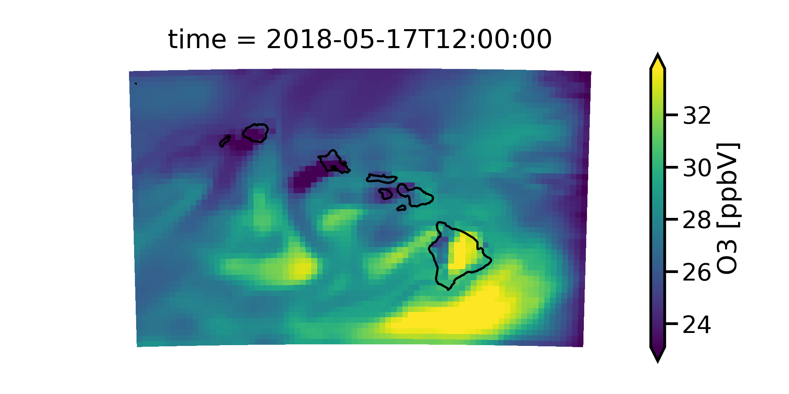

*********************
MONET XArray Accessor
*********************

MONET can add georeferecing tools to xarray‘s data structures. These tools can be
accessed via a special .monet attribute, available for both xarray.DataArray and
xarray.Dataset objects after a simple import monet in your code.

Initializing the Accessor
--------------------------

All you have to do is import monet after you import xarray.

.. code-block:: python

    import xarray as xr
    import monet as m

    cmaqfile = monet.__path__ + '/../data/aqm.t12z.aconc.ncf'

    from monet.models import cmaq

    c = cmaq.open_dataset(cmaqfile)

    c.O3[0,0,:,:].monet.quick_map()

Interpolation Accessors
-----------------------

The MONET accessor provides several useful interpolation routines including:
Getting the nearest point to a given latitude and longitude, interpolating to a
constant latitude or longitude, interpolating to a vertical levels, and remapping
entire 2D :py:class::`~xarray.DataArray` or :py::class::`xarray.DataSet`.

Find Nearest Lat lon point
^^^^^^^^^^^^^^^^^^^^^^^^^^

To find the nearest latitude longitude point you just need to use the
.monet.nearest_latlon method. In this example we will continue to use the CMAQ
test file above.  We will find the closest grid points to lat=20.5, lon=-157.4.

.. code-block:: python

    c.monet.nearest_latlon(lat=20.5,lon=-157.4)

.. parsed-literal::

  <xarray.Dataset>
  Dimensions:    (time: 48, x: 1, y: 1, z: 1)
  Coordinates:
  * time       (time) datetime64[ns] 2018-05-17T12:00:00 2018-05-17T13:00:00 ...
    latitude   (y, x) float64 dask.array<shape=(1, 1), chunksize=(1, 1)>
    longitude  (y, x) float64 dask.array<shape=(1, 1), chunksize=(1, 1)>
  Dimensions without coordinates: x, y, z
  Data variables:
    O3         (time, z, y, x) float32 dask.array<shape=(48, 1, 1, 1), chunksize=(48, 1, 1, 1)>
    NO2        (time, z, y, x) float32 dask.array<shape=(48, 1, 1, 1), chunksize=(48, 1, 1, 1)>
    NO         (time, z, y, x) float32 dask.array<shape=(48, 1, 1, 1), chunksize=(48, 1, 1, 1)>
    NO3        (time, z, y, x) float32 dask.array<shape=(48, 1, 1, 1), chunksize=(48, 1, 1, 1)>
    N2O5       (time, z, y, x) float32 dask.array<shape=(48, 1, 1, 1), chunksize=(48, 1, 1, 1)>
    HNO3       (time, z, y, x) float32 dask.array<shape=(48, 1, 1, 1), chunksize=(48, 1, 1, 1)>
    HONO       (time, z, y, x) float32 dask.array<shape=(48, 1, 1, 1), chunksize=(48, 1, 1, 1)>
    PNA        (time, z, y, x) float32 dask.array<shape=(48, 1, 1, 1), chunksize=(48, 1, 1, 1)>
    CO         (time, z, y, x) float32 dask.array<shape=(48, 1, 1, 1), chunksize=(48, 1, 1, 1)>
    FORM       (time, z, y, x) float32 dask.array<shape=(48, 1, 1, 1), chunksize=(48, 1, 1, 1)>
    ALD2       (time, z, y, x) float32 dask.array<shape=(48, 1, 1, 1), chunksize=(48, 1, 1, 1)>
    PAN        (time, z, y, x) float32 dask.array<shape=(48, 1, 1, 1), chunksize=(48, 1, 1, 1)>
    NTR        (time, z, y, x) float32 dask.array<shape=(48, 1, 1, 1), chunksize=(48, 1, 1, 1)>
    XO2N       (time, z, y, x) float32 dask.array<shape=(48, 1, 1, 1), chunksize=(48, 1, 1, 1)>
    SO2        (time, z, y, x) float32 dask.array<shape=(48, 1, 1, 1), chunksize=(48, 1, 1, 1)>
    ASO4I      (time, z, y, x) float32 dask.array<shape=(48, 1, 1, 1), chunksize=(48, 1, 1, 1)>
    ASO4J      (time, z, y, x) float32 dask.array<shape=(48, 1, 1, 1), chunksize=(48, 1, 1, 1)>
    ANH4I      (time, z, y, x) float32 dask.array<shape=(48, 1, 1, 1), chunksize=(48, 1, 1, 1)>
    ANH4J      (time, z, y, x) float32 dask.array<shape=(48, 1, 1, 1), chunksize=(48, 1, 1, 1)>
    ANO3I      (time, z, y, x) float32 dask.array<shape=(48, 1, 1, 1), chunksize=(48, 1, 1, 1)>
    ANO3J      (time, z, y, x) float32 dask.array<shape=(48, 1, 1, 1), chunksize=(48, 1, 1, 1)>
    AORGAI     (time, z, y, x) float32 dask.array<shape=(48, 1, 1, 1), chunksize=(48, 1, 1, 1)>
    AORGAJ     (time, z, y, x) float32 dask.array<shape=(48, 1, 1, 1), chunksize=(48, 1, 1, 1)>
    AORGPAI    (time, z, y, x) float32 dask.array<shape=(48, 1, 1, 1), chunksize=(48, 1, 1, 1)>
    AORGPAJ    (time, z, y, x) float32 dask.array<shape=(48, 1, 1, 1), chunksize=(48, 1, 1, 1)>
    AORGBI     (time, z, y, x) float32 dask.array<shape=(48, 1, 1, 1), chunksize=(48, 1, 1, 1)>
    AORGBJ     (time, z, y, x) float32 dask.array<shape=(48, 1, 1, 1), chunksize=(48, 1, 1, 1)>
    AECI       (time, z, y, x) float32 dask.array<shape=(48, 1, 1, 1), chunksize=(48, 1, 1, 1)>
    AECJ       (time, z, y, x) float32 dask.array<shape=(48, 1, 1, 1), chunksize=(48, 1, 1, 1)>
    A25I       (time, z, y, x) float32 dask.array<shape=(48, 1, 1, 1), chunksize=(48, 1, 1, 1)>
    A25J       (time, z, y, x) float32 dask.array<shape=(48, 1, 1, 1), chunksize=(48, 1, 1, 1)>
    NUMATKN    (time, z, y, x) float32 dask.array<shape=(48, 1, 1, 1), chunksize=(48, 1, 1, 1)>
    NUMACC     (time, z, y, x) float32 dask.array<shape=(48, 1, 1, 1), chunksize=(48, 1, 1, 1)>
    SRFATKN    (time, z, y, x) float32 dask.array<shape=(48, 1, 1, 1), chunksize=(48, 1, 1, 1)>
    SRFACC     (time, z, y, x) float32 dask.array<shape=(48, 1, 1, 1), chunksize=(48, 1, 1, 1)>
    AH2OI      (time, z, y, x) float32 dask.array<shape=(48, 1, 1, 1), chunksize=(48, 1, 1, 1)>
    AH2OJ      (time, z, y, x) float32 dask.array<shape=(48, 1, 1, 1), chunksize=(48, 1, 1, 1)>
    ACLI       (time, z, y, x) float32 dask.array<shape=(48, 1, 1, 1), chunksize=(48, 1, 1, 1)>
    ACLJ       (time, z, y, x) float32 dask.array<shape=(48, 1, 1, 1), chunksize=(48, 1, 1, 1)>
    ANAI       (time, z, y, x) float32 dask.array<shape=(48, 1, 1, 1), chunksize=(48, 1, 1, 1)>
    ANAJ       (time, z, y, x) float32 dask.array<shape=(48, 1, 1, 1), chunksize=(48, 1, 1, 1)>
    PM25       (time, z, y, x) float32 dask.array<shape=(48, 1, 1, 1), chunksize=(48, 1, 1, 1)>
    PM10       (time, z, y, x) float32 dask.array<shape=(48, 1, 1, 1), chunksize=(48, 1, 1, 1)>
    CLf        (time, z, y, x) float32 dask.array<shape=(48, 1, 1, 1), chunksize=(48, 1, 1, 1)>
    NAf        (time, z, y, x) float32 dask.array<shape=(48, 1, 1, 1), chunksize=(48, 1, 1, 1)>
    NOy        (time, z, y, x) float32 dask.array<shape=(48, 1, 1, 1), chunksize=(48, 1, 1, 1)>
    NOx        (time, z, y, x) float32 dask.array<shape=(48, 1, 1, 1), chunksize=(48, 1, 1, 1)>
    NO3f       (time, z, y, x) float32 dask.array<shape=(48, 1, 1, 1), chunksize=(48, 1, 1, 1)>
    NH4f       (time, z, y, x) float32 dask.array<shape=(48, 1, 1, 1), chunksize=(48, 1, 1, 1)>
    SO4f       (time, z, y, x) float32 dask.array<shape=(48, 1, 1, 1), chunksize=(48, 1, 1, 1)>
  Attributes:
    IOAPI_VERSION:   $Id: @(#) ioapi library version 3.1 $                   ...
    EXEC_ID:         ????????????????                                        ...
    FTYPE:           1
    CDATE:           2018142
    CTIME:           135716
    WDATE:           2018142
    WTIME:           135716
    SDATE:           2018137
    STIME:           120000
    TSTEP:           10000
    NTHIK:           1
    NCOLS:           80
    NROWS:           52
    NLAYS:           1
    NVARS:           41
    GDTYP:           2
    P_ALP:           19.0
    P_BET:           21.0
    P_GAM:           -157.5
    XCENT:           -157.5
    YCENT:           20.53
    XORIG:           -480000.0
    YORIG:           -312000.0
    XCELL:           12000.0
    YCELL:           12000.0
    VGTYP:           1
    VGTOP:           200.0
    VGLVLS:          [1.       0.089794]
    GDNAM:           AQF_HI
    UPNAM:           OPACONC
    VAR-LIST:        O3              NO2             NO              NO3     ...
    FILEDESC:        Concentration file output                               ...
    HISTORY:
    proj4_srs:       +proj=lcc +lat_1=19.0 +lat_2=21.0 +lat_0=20.53 +lon_0=-1...
    area:            Area ID: MONET_Object_Grid\nDescription: IOAPI area_def ...
    mapping_tables:  {'improve': {}, 'aqs': {'OZONE': ['O3'], 'PM2.5': ['PM25...

Notice that the length of the dimensions are now (time: 48, x: 1, y: 1, z: 1).
If you wanted to only find the nearest location for a single variable you can
use the accessor on the :py:class:`~xarray.DataArray`.

.. code:: python

    c.O3.monet.nearest_latlon(lat=20.5,lon=-157.4)

.. parsed-literal::

  <xarray.DataArray 'O3' (time: 48, z: 1, y: 1, x: 1)>
  dask.array<shape=(48, 1, 1, 1), dtype=float32, chunksize=(48, 1, 1, 1)>
  Coordinates:
   * time       (time) datetime64[ns] 2018-05-17T12:00:00 2018-05-17T13:00:00 ...
     latitude   (y, x) float64 dask.array<shape=(1, 1), chunksize=(1, 1)>
     longitude  (y, x) float64 dask.array<shape=(1, 1), chunksize=(1, 1)>
  Dimensions without coordinates: z, y, x
  Attributes:
     long_name:   O3
     units:       ppbV
     var_desc:    Variable O3
     proj4_srs:   +proj=lcc +lat_1=19.0 +lat_2=21.0 +lat_0=20.53 +lon_0=-157.5...
     area:        Shape: (1, 1)\nLons: [[-157.4]]\nLats: [[20.5]]
     _FillValue:  nan
