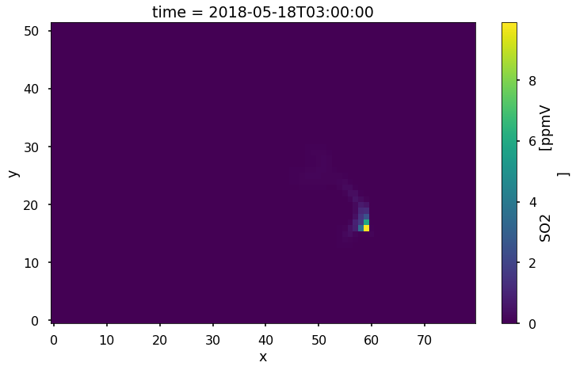
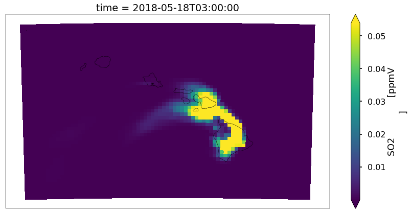
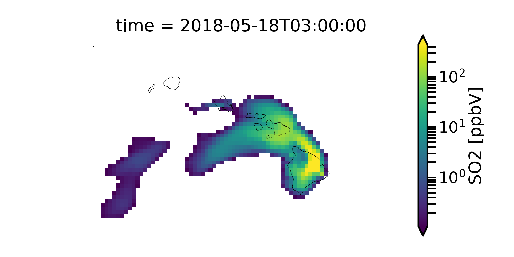
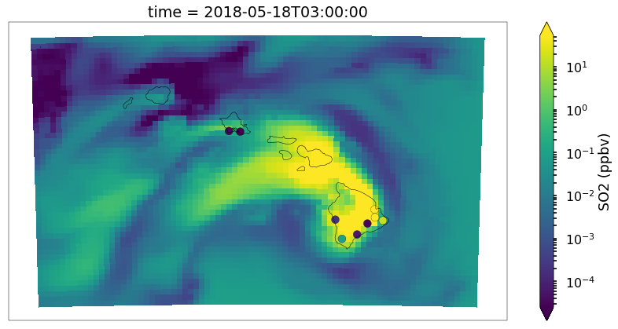

How to Open and View CMAQ simulations - HI Volcano Example
==========================================================

In this example, we will learn how to open CMAQ simulations using MONET,
view the data on a map, view cross sections of the data, and compare to
surface observations (AirNow) for the May 2018 Hawaiian volcanic
eruption. First, import MONET and several helper functions for later.

.. code:: python

    from monet.obs import airnow
    from monet.models import cmaq
    import matplotlib.pyplot as plt
    from monet.util import tools
    import pandas as pd

Now the data can be downloaded from the MONET github page in the
MONET/data directory. We will assume you already have this downloaded
and will proceed. Open the simulation. As of right now we still require
that a seperate grdcro2d (grddot2d) file be loaded for the mass points
(dot points) using the ``grid`` kwarg.

.. code:: python

    conc = '/Users/barry/Desktop/MONET/data/aqm.t12z.aconc.ncf'
    c = cmaq.open_dtaset(flist=conc)

The cmaq object will return a ``xarray.Dataset`` but it also still lives
inside of the ``cmaq`` object in ``cmaq.dset``. We may use a combination
of both the dataset (c) directly and the cmaq calls to gather or
aggrigate species in the concentration file.

.. code:: python

    c

.. parsed-literal::

  <xarray.Dataset>
  Dimensions:    (DATE-TIME: 2, VAR: 41, time: 48, x: 80, y: 52, z: 1)
  Coordinates:
  * time       (time) datetime64[ns] 2018-05-17T12:00:00 2018-05-17T13:00:00 ...
    longitude  (y, x) float64 -161.9 -161.8 -161.7 -161.6 -161.5 -161.4 ...
    latitude   (y, x) float64 17.76 17.76 17.77 17.77 17.77 17.77 17.78 ...
  Dimensions without coordinates: DATE-TIME, VAR, x, y, z
  Data variables:
    TFLAG      (time, VAR, DATE-TIME) int32 ...
    O3         (time, z, y, x) float32 28.296675 28.461445 28.483536 ...
    NO2        (time, z, y, x) float32 0.0072615896 0.007076008 0.0070880884 ...
    NO         (time, z, y, x) float32 1.6760728e-08 1.6089658e-08 ...
    NO3        (time, z, y, x) float32 0.0022378012 0.0022129775 ...
    N2O5       (time, z, y, x) float32 8.560217e-06 8.241847e-06 ...
    HNO3       (time, z, y, x) float32 0.1326946 0.13388994 0.1343063 ...
    HONO       (time, z, y, x) float32 6.2205704e-06 5.9552485e-06 ...
    PNA        (time, z, y, x) float32 2.1638462e-07 1.9233373e-07 ...
    CO         (time, z, y, x) float32 72.599915 72.56304 72.599266 ...
    FORM       (time, z, y, x) float32 0.3351323 0.3413216 0.34457546 ...
    ALD2       (time, z, y, x) float32 0.13579664 0.12625198 0.1253843 ...
    PAN        (time, z, y, x) float32 0.00054027676 0.00047953427 ...
    NTR        (time, z, y, x) float32 0.0057188044 0.0053887735 0.005364259 ...
    XO2N       (time, z, y, x) float32 2.1813818e-05 2.1018073e-05 ...
    SO2        (time, z, y, x) float32 0.009011468 0.009855208 0.009888159 ...
    ASO4I      (time, z, y, x) float32 0.00071987335 0.0006097436 ...
    ASO4J      (time, z, y, x) float32 0.6792807 0.68186235 0.6739671 ...
    ANH4I      (time, z, y, x) float32 5.4321783e-05 4.6263896e-05 ...
    ANH4J      (time, z, y, x) float32 0.051220056 0.051677197 0.05048342 ...
    ANO3I      (time, z, y, x) float32 9.547329e-16 8.1884126e-16 ...
    ANO3J      (time, z, y, x) float32 8.933346e-13 9.0928e-13 5.418493e-05 ...
    AORGAI     (time, z, y, x) float32 1.4356241e-10 1.308317e-10 ...
    AORGAJ     (time, z, y, x) float32 1.2230534e-05 1.1428401e-05 ...
    AORGPAI    (time, z, y, x) float32 6.7508597e-07 6.614316e-07 ...
    AORGPAJ    (time, z, y, x) float32 0.05786852 0.058112975 0.05817498 ...
    AORGBI     (time, z, y, x) float32 6.7122006e-09 6.5227788e-09 ...
    AORGBJ     (time, z, y, x) float32 0.0005746193 0.00057244353 ...
    AECI       (time, z, y, x) float32 2.4381194e-07 2.3888646e-07 ...
    AECJ       (time, z, y, x) float32 0.014596849 0.014644699 0.014672826 ...
    A25I       (time, z, y, x) float32 ...
    A25J       (time, z, y, x) float32 ...
    NUMATKN    (time, z, y, x) float32 ...
    NUMACC     (time, z, y, x) float32 ...
    SRFATKN    (time, z, y, x) float32 ...
    SRFACC     (time, z, y, x) float32 ...
    AH2OI      (time, z, y, x) float32 ...
    AH2OJ      (time, z, y, x) float32 ...
    ACLI       (time, z, y, x) float32 ...
    ACLJ       (time, z, y, x) float32 3.5000003e-13 3.5000003e-13 ...
    ANAI       (time, z, y, x) float32 8.394818e-17 8.4039525e-17 ...
    ANAJ       (time, z, y, x) float32 0.2311452 0.23135261 0.23287562 ...
    PM25       (time, z, y, x) float32 1.0354732 1.0388906 1.0314605 ...
    PM10       (time, z, y, x) float32 1.0354732 1.0388906 1.0314605 ...
    CLf        (time, z, y, x) float32 3.5000003e-13 3.5000003e-13 ...
    NAf        (time, z, y, x) float32 0.2311452 0.23135261 0.23287562 ...
    NOy        (time, z, y, x) float32 0.0001484681 0.00014906164 ...
    NOx        (time, z, y, x) float32 1.6760728e-11 1.6089657e-11 ...
    NO3f       (time, z, y, x) float32 8.9428936e-13 9.100988e-13 ...
    NH4f       (time, z, y, x) float32 0.051274378 0.05172346 0.050527096 ...
    SO4f       (time, z, y, x) float32 0.68000054 0.6824721 0.67454904 ...
  Attributes:
    IOAPI_VERSION:   $Id: @(#) ioapi library version 3.1 $                   ...
    EXEC_ID:         ????????????????                                        ...
    FTYPE:           1
    CDATE:           2018142
    CTIME:           135716
    WDATE:           2018142
    WTIME:           135716
    SDATE:           2018137
    STIME:           120000
    TSTEP:           10000
    NTHIK:           1
    NCOLS:           80
    NROWS:           52
    NLAYS:           1
    NVARS:           41
    GDTYP:           2
    P_ALP:           19.0
    P_BET:           21.0
    P_GAM:           -157.5
    XCENT:           -157.5
    YCENT:           20.53
    XORIG:           -480000.0
    YORIG:           -312000.0
    XCELL:           12000.0
    YCELL:           12000.0
    VGTYP:           1
    VGTOP:           200.0
    VGLVLS:          [1.       0.089794]
    GDNAM:           AQF_HI
    UPNAM:           OPACONC
    VAR-LIST:        O3              NO2             NO              NO3     ...
    FILEDESC:        Concentration file output                               ...
    HISTORY:
    proj4_srs:       +proj=lcc +lat_1=19.0 +lat_2=21.0 +lat_0=20.53 +lon_0=-1...
    area:            Area ID: MONET_Object_Grid\nDescription: IOAPI area_def ...
    mapping_tables:  {'improve': {}, 'aqs': {'OZONE': ['O3'], 'PM2.5': ['PM25...

Notice that this looks like the ncdump of the file except that there are
seperate coordinates including the latitude and longitude and the time
as numpy.datetime64 objects. Also included is the proj4 string, a pyresample area grid
and default mapping tables to several different observational datasets.

Plotting on a map
-----------------

It is often useful to be able to view the data on a map. Let’s view a
random time slice of SO2 (we will view time 20 hours into the
simulation).

.. code:: python

    c.SO2[15,0,:,:].monet.quick_map()

.. parsed-literal::

    [########################################] | 100% Completed |  0.1s
    [########################################] | 100% Completed |  0.1s
    [########################################] | 100% Completed |  0.2s
    [########################################] | 100% Completed |  0.3s
    [########################################] | 100% Completed |  0.3s
    [########################################] | 100% Completed |  0.1s
    [########################################] | 100% Completed |  0.1s
    [########################################] | 100% Completed |  0.2s
    [########################################] | 100% Completed |  0.3s
    [########################################] | 100% Completed |  0.4s

.. parsed-literal::

    <matplotlib.collections.QuadMesh at 0x1c27910860>

Now this doesn’t look very pretty. First it isn’t on a map, the color
scale isn’t good as we cannot really see any of the data. To fix this we
will add a map using the MONETAccessor and use the ``robust=True`` kwarg.

.. code:: python

    c.SO2[15,0,:,:].monet.quick_map(robust=True)

Better but we can still do much more. There is low concentrations on
most of this map making it hard to notice the extremely high values and
the SO2 data is in ppmv and not ppbv as normally viewed as. Also, a
logscale may be better fo this type of data as it goes from 0-20000 ppbv
rather than a linear scale.

.. code:: python

    from matplotlib.colors import LogNorm
    # convert to ppbv
    so2 = c.SO2[15,0,:,:]
    so2.where(so2 > 0.1).monet.quick_map(robust=True, norm=LogNorm())

Now let’s us view serveral time slices at once. We will average in time
(every 8 hours) to give us 6 total subplots.

.. code:: python

    so2 = c.SO2[:,0,:,:] * 1000.
    so2_resampled = so2.resample(time='8H').mean('time').sortby(['y', 'x'],ascending=True)
    p = so2_resampled.plot.contourf(col_wrap=3,col='time',x='longitude',y='latitude',robust=True,figsize=(15,10),subplot_kws={'projection': ccrs.PlateCarree()})
    extent = [so2.longitude.min(),so2.longitude.max(),so2.latitude.min(),so2.latitude.max()]
    for ax in p.axes.flat:
        draw_map(ax=ax,resolution='10m',extent=extent)

.. image:: CMAQ_hi_volcano_files/CMAQ_hi_volcano_15_1.png

Finding nearest lat lon point
-----------------------------

Suppose that we want to find the model data found at a point
(latitude,longitude). Use the MONETAccessor again

.. code:: python

    so2.monet.nearest_latlon(lat=20.5,lon=157.5).plot(figsize=(12,6))
    plt.xlabel('')
    plt.tight_layout()

.. image:: CMAQ_hi_volcano_files/CMAQ_hi_volcano_17_2.png

Pairing with AirNow
-------------------

It is often useful to be able to pair model data with observational
data. MONET uses the pyresample library
(http://pyresample.readthedocs.io/en/latest/) to do a nearest neighbor
interpolation. First let us get the airnow data for the dates of the
simulation. We will also rotate it from the raw AirNow long format (stacked variables) to a wide format (each variable is a seperate column)

.. code:: python

    from monet.util import tools
    df = airnow.add_data(so2.time.to_index())
    df = tools.long_to_wide(df)

.. parsed-literal::

    Aggregating AIRNOW files...
    Building AIRNOW URLs...
    [########################################] | 100% Completed |  1.3s
    [########################################] | 100% Completed |  1.4s
    [########################################] | 100% Completed |  1.4s
    [########################################] | 100% Completed |  1.5s
    [########################################] | 100% Completed |  1.5s
    [########################################] | 100% Completed | 12.3s
    [########################################] | 100% Completed | 12.4s
    [########################################] | 100% Completed | 12.4s
    [########################################] | 100% Completed | 12.5s
    [########################################] | 100% Completed | 12.6s
        Adding in Meta-data

Now let us combine the two. This will return the pandas dataframe with a
new column (model).

.. code:: python

    df_combined = so2.monet.combine_point(df,col='SO2')

.. parsed-literal::

  [########################################] | 100% Completed |  0.1s
  [########################################] | 100% Completed |  0.2s
  [########################################] | 100% Completed |  0.1s
  [########################################] | 100% Completed |  0.2s
  [########################################] | 100% Completed |  0.1s
  [########################################] | 100% Completed |  0.2s

Let’s look at the distributions to see if the two overlap to get a
general scence of performance.

.. code:: python

    df_so2 = df.loc[(df.variable == 'SO2') & (df.state_name == 'HI')].dropna(subset=['obs'])
    import seaborn as sns
    f,ax = plt.subplots(figsize=(12,7))
    sns.kdeplot(df_so2.obs, ax=ax, clip=[0,500])
    sns.kdeplot(df_so2.model,ax=ax, clip=[0,500])

.. parsed-literal::

    <matplotlib.axes._subplots.AxesSubplot at 0x1c290e94a8>

.. image:: CMAQ_hi_volcano_files/CMAQ_hi_volcano_25_1.png

Overlaying Observations on Contour Plots
----------------------------------------

Now let’s put a time slice on a map. Let’s look back to the time step
‘2018-05-18 03:00’,

.. code:: python

    from monet.plots import *
    ax = draw_map(states=True, resolution='10m', figsize=(15,7))
    so2_now = so2.sel(time='2018-05-18 03:00')
    p = so2_now.plot(x='longitude',y='latitude',ax=ax, robust=True,norm=LogNorm(),cbar_kwargs={'label': 'SO2 (ppbv)'})
    vmin,vmax = p.get_clim()
    cmap = p.get_cmap()
    d = df_so2.loc[df_so2.time == '2018-05-18 03:00']
    plt.scatter(d.longitude.values,d.latitude.values,c=d.obs,cmap=cmap,vmin=vmin,vmax=vmax)

.. parsed-literal::

    {'figsize': (15, 7), 'subplot_kw': {'projection': <cartopy.crs.PlateCarree object at 0x1c27451d00>}}
    [########################################] | 100% Completed |  0.1s
    [########################################] | 100% Completed |  0.2s
    [########################################] | 100% Completed |  0.3s
    [########################################] | 100% Completed |  0.3s
    [########################################] | 100% Completed |  0.4s
    [########################################] | 100% Completed |  0.1s
    [########################################] | 100% Completed |  0.2s
    [########################################] | 100% Completed |  0.3s
    [########################################] | 100% Completed |  0.3s
    [########################################] | 100% Completed |  0.4s

.. parsed-literal::

    <matplotlib.collections.PathCollection at 0x1c2ae207b8>

Not bad but again we can do a little better with the scatter plot. It’s
hard to see the outlines of the observations when there is high
correlation, the sizes may be a little large

.. code:: python

    ax = draw_map(states=True, resolution='10m', figsize=(15,7))

    so2_now = so2.sel(time='2018-05-18 03:00')
    p = so2_now.plot(x='longitude',y='latitude',ax=ax, robust=True,norm=LogNorm(),cbar_kwargs={'label': 'SO2 (ppbv)'})
    vmin,vmax = p.get_clim()
    cmap = p.get_cmap()
    d = df_so2.loc[df_so2.time == '2018-05-18 03:00']
    plt.scatter(d.longitude.values,d.latitude.values,c=d.obs,cmap=cmap,s=100,edgecolors='k',lw=.25, vmin=vmin,vmax=vmax)

.. parsed-literal::

    {'figsize': (15, 7), 'subplot_kw': {'projection': <cartopy.crs.PlateCarree object at 0x1c2b0ead00>}}
    [########################################] | 100% Completed |  0.1s
    [########################################] | 100% Completed |  0.1s
    [########################################] | 100% Completed |  0.1s
    [########################################] | 100% Completed |  0.2s
    [########################################] | 100% Completed |  0.3s
    [########################################] | 100% Completed |  0.1s
    [########################################] | 100% Completed |  0.2s
    [########################################] | 100% Completed |  0.3s
    [########################################] | 100% Completed |  0.4s
    [########################################] | 100% Completed |  0.5s

.. parsed-literal::

    <matplotlib.collections.PathCollection at 0x1c2b43c5f8>

.. code:: python

    p = df_so2.loc[df_so2.obs > 10]
    p.obs.std()

.. parsed-literal::

    61.45120441800254
