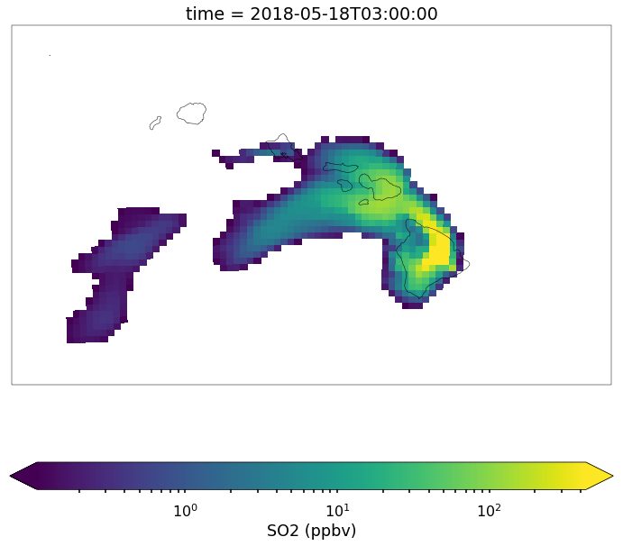

How to Open and View CMAQ simulations - HI Volcano Example
==========================================================

In this example, we will learn how to open CMAQ simulations using MONET,
view the data on a map, view cross sections of the data, and compare to
surface observations (AirNow) for the May 2018 Hawaiian volcanic
eruption. First, import MONET and several helper functions for later.

.. code:: ipython3

    from monet.obs import airnow
    from monet.models import cmaq
    import matplotlib.pyplot as plt
    from monet.util import tools
    from monet.plots.mapgen import *
    import pandas as pd 

Now the data can be downloaded from the MONET github page in the
MONET/data directory. We will assume you already have this downloaded
and will proceed. Open the simulation. As of right now we still require
that a seperate grdcro2d (grddot2d) file be loaded for the mass points
(dot points) using the ``grid`` kwarg.

.. code:: ipython3

    conc = '/Users/barry/Desktop/MONET/data/aqm.t12z.aconc.ncf'
    grid = '/Users/barry/Desktop/MONET/data/aqm.t12z.grdcro2d.ncf'
    c = cmaq.open_files(flist=conc,grid=grid)

.. parsed-literal::

    [########################################] | 100% Completed |  0.3s
    [########################################] | 100% Completed |  0.3s
    [########################################] | 100% Completed |  0.5s
    [########################################] | 100% Completed |  0.6s
    [########################################] | 100% Completed |  0.6s
    [########################################] | 100% Completed |  0.1s
    [########################################] | 100% Completed |  0.2s
    [########################################] | 100% Completed |  0.3s
    [########################################] | 100% Completed |  0.3s
    [########################################] | 100% Completed |  0.4s
    [########################################] | 100% Completed |  0.1s
    [########################################] | 100% Completed |  0.1s
    [########################################] | 100% Completed |  0.2s
    [########################################] | 100% Completed |  0.3s
    [########################################] | 100% Completed |  0.4s
    [########################################] | 100% Completed |  0.2s
    [########################################] | 100% Completed |  0.3s
    [########################################] | 100% Completed |  0.3s
    [########################################] | 100% Completed |  0.4s
    [########################################] | 100% Completed |  0.4s
    [########################################] | 100% Completed |  0.1s
    [########################################] | 100% Completed |  0.1s
    [########################################] | 100% Completed |  0.2s
    [########################################] | 100% Completed |  0.2s
    [########################################] | 100% Completed |  0.3s
    [########################################] | 100% Completed |  0.1s
    [########################################] | 100% Completed |  0.2s
    [########################################] | 100% Completed |  0.3s
    [########################################] | 100% Completed |  0.4s
    [########################################] | 100% Completed |  0.5s
    [########################################] | 100% Completed |  0.1s
    [########################################] | 100% Completed |  0.2s
    [########################################] | 100% Completed |  0.3s
    [########################################] | 100% Completed |  0.4s
    [########################################] | 100% Completed |  0.4s
    [########################################] | 100% Completed |  0.1s
    [########################################] | 100% Completed |  0.1s
    [########################################] | 100% Completed |  0.2s
    [########################################] | 100% Completed |  0.2s
    [########################################] | 100% Completed |  0.3s
    [########################################] | 100% Completed |  0.1s
    [########################################] | 100% Completed |  0.2s
    [########################################] | 100% Completed |  0.3s
    [########################################] | 100% Completed |  0.4s
    [########################################] | 100% Completed |  0.5s
    [########################################] | 100% Completed |  0.1s
    [########################################] | 100% Completed |  0.1s
    [########################################] | 100% Completed |  0.2s
    [########################################] | 100% Completed |  0.2s
    [########################################] | 100% Completed |  0.3s
    [########################################] | 100% Completed |  0.1s
    [########################################] | 100% Completed |  0.2s
    [########################################] | 100% Completed |  0.2s
    [########################################] | 100% Completed |  0.3s
    [########################################] | 100% Completed |  0.4s
    [########################################] | 100% Completed |  0.1s
    [########################################] | 100% Completed |  0.1s
    [########################################] | 100% Completed |  0.2s
    [########################################] | 100% Completed |  0.3s
    [########################################] | 100% Completed |  0.4s
    [########################################] | 100% Completed |  0.1s
    [########################################] | 100% Completed |  0.2s
    [########################################] | 100% Completed |  0.2s
    [########################################] | 100% Completed |  0.3s
    [########################################] | 100% Completed |  0.4s
    [########################################] | 100% Completed |  0.1s
    [########################################] | 100% Completed |  0.1s
    [########################################] | 100% Completed |  0.2s
    [########################################] | 100% Completed |  0.2s
    [########################################] | 100% Completed |  0.3s
    [########################################] | 100% Completed |  0.1s
    [########################################] | 100% Completed |  0.1s
    [########################################] | 100% Completed |  0.1s
    [########################################] | 100% Completed |  0.2s
    [########################################] | 100% Completed |  0.3s
    [########################################] | 100% Completed |  0.1s
    [########################################] | 100% Completed |  0.1s
    [########################################] | 100% Completed |  0.2s
    [########################################] | 100% Completed |  0.3s
    [########################################] | 100% Completed |  0.3s
    [########################################] | 100% Completed |  0.1s
    [########################################] | 100% Completed |  0.2s
    [########################################] | 100% Completed |  0.2s
    [########################################] | 100% Completed |  0.3s
    [########################################] | 100% Completed |  0.3s
    [########################################] | 100% Completed |  0.1s
    [########################################] | 100% Completed |  0.2s
    [########################################] | 100% Completed |  0.3s
    [########################################] | 100% Completed |  0.4s
    [########################################] | 100% Completed |  0.5s
    [########################################] | 100% Completed |  0.1s
    [########################################] | 100% Completed |  0.2s
    [########################################] | 100% Completed |  0.3s
    [########################################] | 100% Completed |  0.4s
    [########################################] | 100% Completed |  0.5s
    [########################################] | 100% Completed |  0.1s
    [########################################] | 100% Completed |  0.1s
    [########################################] | 100% Completed |  0.2s
    [########################################] | 100% Completed |  0.3s
    [########################################] | 100% Completed |  0.4s
    [########################################] | 100% Completed |  0.1s
    [########################################] | 100% Completed |  0.2s
    [########################################] | 100% Completed |  0.2s
    [########################################] | 100% Completed |  0.3s
    [########################################] | 100% Completed |  0.3s
    [########################################] | 100% Completed |  0.1s
    [########################################] | 100% Completed |  0.2s
    [########################################] | 100% Completed |  0.3s
    [########################################] | 100% Completed |  0.4s
    [########################################] | 100% Completed |  0.5s
    [########################################] | 100% Completed |  0.1s
    [########################################] | 100% Completed |  0.2s
    [########################################] | 100% Completed |  0.3s
    [########################################] | 100% Completed |  0.4s
    [########################################] | 100% Completed |  0.5s
    [########################################] | 100% Completed |  0.1s
    [########################################] | 100% Completed |  0.2s
    [########################################] | 100% Completed |  0.2s
    [########################################] | 100% Completed |  0.3s
    [########################################] | 100% Completed |  0.4s
    [########################################] | 100% Completed |  0.1s
    [########################################] | 100% Completed |  0.1s
    [########################################] | 100% Completed |  0.2s
    [########################################] | 100% Completed |  0.3s
    [########################################] | 100% Completed |  0.4s
    [########################################] | 100% Completed |  0.1s
    [########################################] | 100% Completed |  0.2s
    [########################################] | 100% Completed |  0.3s
    [########################################] | 100% Completed |  0.4s
    [########################################] | 100% Completed |  0.5s
    [########################################] | 100% Completed |  0.1s
    [########################################] | 100% Completed |  0.2s
    [########################################] | 100% Completed |  0.3s
    [########################################] | 100% Completed |  0.3s
    [########################################] | 100% Completed |  0.3s
    [########################################] | 100% Completed |  0.1s
    [########################################] | 100% Completed |  0.2s
    [########################################] | 100% Completed |  0.3s
    [########################################] | 100% Completed |  0.4s
    [########################################] | 100% Completed |  0.5s
    [########################################] | 100% Completed |  0.1s
    [########################################] | 100% Completed |  0.2s
    [########################################] | 100% Completed |  0.2s
    [########################################] | 100% Completed |  0.3s
    [########################################] | 100% Completed |  0.4s
    [########################################] | 100% Completed |  0.1s
    [########################################] | 100% Completed |  0.2s
    [########################################] | 100% Completed |  0.3s
    [########################################] | 100% Completed |  0.4s
    [########################################] | 100% Completed |  0.5s
    [########################################] | 100% Completed |  0.1s
    [########################################] | 100% Completed |  0.2s
    [########################################] | 100% Completed |  0.3s
    [########################################] | 100% Completed |  0.4s
    [########################################] | 100% Completed |  0.5s
    [########################################] | 100% Completed |  0.1s
    [########################################] | 100% Completed |  0.1s
    [########################################] | 100% Completed |  0.2s
    [########################################] | 100% Completed |  0.2s
    [########################################] | 100% Completed |  0.3s
    [########################################] | 100% Completed |  0.1s
    [########################################] | 100% Completed |  0.2s
    [########################################] | 100% Completed |  0.3s
    [########################################] | 100% Completed |  0.4s
    [########################################] | 100% Completed |  0.5s
    [########################################] | 100% Completed |  0.1s
    [########################################] | 100% Completed |  0.2s
    [########################################] | 100% Completed |  0.2s
    [########################################] | 100% Completed |  0.3s
    [########################################] | 100% Completed |  0.4s
    [########################################] | 100% Completed |  0.1s
    [########################################] | 100% Completed |  0.1s
    [########################################] | 100% Completed |  0.2s
    [########################################] | 100% Completed |  0.2s
    [########################################] | 100% Completed |  0.2s
    [########################################] | 100% Completed |  0.1s
    [########################################] | 100% Completed |  0.1s
    [########################################] | 100% Completed |  0.2s
    [########################################] | 100% Completed |  0.3s
    [########################################] | 100% Completed |  0.4s
    [########################################] | 100% Completed |  0.1s
    [########################################] | 100% Completed |  0.2s
    [########################################] | 100% Completed |  0.3s
    [########################################] | 100% Completed |  0.4s
    [########################################] | 100% Completed |  0.5s
    [########################################] | 100% Completed |  0.1s
    [########################################] | 100% Completed |  0.2s
    [########################################] | 100% Completed |  0.3s
    [########################################] | 100% Completed |  0.4s
    [########################################] | 100% Completed |  0.5s
    [########################################] | 100% Completed |  0.1s
    [########################################] | 100% Completed |  0.2s
    [########################################] | 100% Completed |  0.3s
    [########################################] | 100% Completed |  0.4s
    [########################################] | 100% Completed |  0.5s
    [########################################] | 100% Completed |  0.1s
    [########################################] | 100% Completed |  0.2s
    [########################################] | 100% Completed |  0.2s
    [########################################] | 100% Completed |  0.3s
    [########################################] | 100% Completed |  0.4s
    [########################################] | 100% Completed |  0.1s
    [########################################] | 100% Completed |  0.2s
    [########################################] | 100% Completed |  0.3s
    [########################################] | 100% Completed |  0.4s
    [########################################] | 100% Completed |  0.5s
    [########################################] | 100% Completed |  0.1s
    [########################################] | 100% Completed |  0.1s
    [########################################] | 100% Completed |  0.2s
    [########################################] | 100% Completed |  0.3s
    [########################################] | 100% Completed |  0.4s
    Reading CMAQ dates...
    [########################################] | 100% Completed |  0.1s
    [########################################] | 100% Completed |  0.1s
    [########################################] | 100% Completed |  0.2s
    [########################################] | 100% Completed |  0.3s
    [########################################] | 100% Completed |  0.4s
    [########################################] | 100% Completed |  0.1s
    [########################################] | 100% Completed |  0.2s
    [########################################] | 100% Completed |  0.3s
    [########################################] | 100% Completed |  0.3s
    [########################################] | 100% Completed |  0.3s
    [########################################] | 100% Completed |  0.1s
    [########################################] | 100% Completed |  0.2s
    [########################################] | 100% Completed |  0.2s
    [########################################] | 100% Completed |  0.2s
    [########################################] | 100% Completed |  0.3s

.. parsed-literal::

    /anaconda3/lib/python3.6/_collections_abc.py:702: FutureWarning: calling len() on an xarray.Dataset will change in xarray v0.11 to only include data variables, not coordinates. Call len() on the Dataset.variables property instead, like ``len(ds.variables)``, to preserve existing behavior in a forwards compatible manner.
      return len(self._mapping)
    /anaconda3/lib/python3.6/_collections_abc.py:720: FutureWarning: iteration over an xarray.Dataset will change in xarray v0.11 to only include data variables, not coordinates. Iterate over the Dataset.variables property instead to preserve existing behavior in a forwards compatible manner.
      yield from self._mapping

The cmaq object will return a ``xarray.Dataset`` but it also still lives
inside of the ``cmaq`` object in ``cmaq.dset``. We may use a combination
of both the dataset (c) directly and the cmaq calls to gather or
aggrigate species in the concentration file.

.. code:: ipython3

    c

.. parsed-literal::

    <xarray.Dataset>
    Dimensions:    (DATE-TIME: 2, VAR: 41, time: 48, x: 80, y: 52, z: 1)
    Coordinates:
      * time       (time) datetime64[ns] 2018-05-17T12:00:00 2018-05-17T13:00:00 ...
        latitude   (y, x) float32 ...
        longitude  (y, x) float32 ...
    Dimensions without coordinates: DATE-TIME, VAR, x, y, z
    Data variables:
        TFLAG      (time, VAR, DATE-TIME) int32 dask.array<shape=(48, 41, 2), chunksize=(48, 41, 2)>
        O3         (time, z, y, x) float32 dask.array<shape=(48, 1, 52, 80), chunksize=(48, 1, 52, 80)>
        NO2        (time, z, y, x) float32 dask.array<shape=(48, 1, 52, 80), chunksize=(48, 1, 52, 80)>
        NO         (time, z, y, x) float32 dask.array<shape=(48, 1, 52, 80), chunksize=(48, 1, 52, 80)>
        NO3        (time, z, y, x) float32 dask.array<shape=(48, 1, 52, 80), chunksize=(48, 1, 52, 80)>
        N2O5       (time, z, y, x) float32 dask.array<shape=(48, 1, 52, 80), chunksize=(48, 1, 52, 80)>
        HNO3       (time, z, y, x) float32 dask.array<shape=(48, 1, 52, 80), chunksize=(48, 1, 52, 80)>
        HONO       (time, z, y, x) float32 dask.array<shape=(48, 1, 52, 80), chunksize=(48, 1, 52, 80)>
        PNA        (time, z, y, x) float32 dask.array<shape=(48, 1, 52, 80), chunksize=(48, 1, 52, 80)>
        CO         (time, z, y, x) float32 dask.array<shape=(48, 1, 52, 80), chunksize=(48, 1, 52, 80)>
        FORM       (time, z, y, x) float32 dask.array<shape=(48, 1, 52, 80), chunksize=(48, 1, 52, 80)>
        ALD2       (time, z, y, x) float32 dask.array<shape=(48, 1, 52, 80), chunksize=(48, 1, 52, 80)>
        PAN        (time, z, y, x) float32 dask.array<shape=(48, 1, 52, 80), chunksize=(48, 1, 52, 80)>
        NTR        (time, z, y, x) float32 dask.array<shape=(48, 1, 52, 80), chunksize=(48, 1, 52, 80)>
        XO2N       (time, z, y, x) float32 dask.array<shape=(48, 1, 52, 80), chunksize=(48, 1, 52, 80)>
        SO2        (time, z, y, x) float32 dask.array<shape=(48, 1, 52, 80), chunksize=(48, 1, 52, 80)>
        ASO4I      (time, z, y, x) float32 dask.array<shape=(48, 1, 52, 80), chunksize=(48, 1, 52, 80)>
        ASO4J      (time, z, y, x) float32 dask.array<shape=(48, 1, 52, 80), chunksize=(48, 1, 52, 80)>
        ANH4I      (time, z, y, x) float32 dask.array<shape=(48, 1, 52, 80), chunksize=(48, 1, 52, 80)>
        ANH4J      (time, z, y, x) float32 dask.array<shape=(48, 1, 52, 80), chunksize=(48, 1, 52, 80)>
        ANO3I      (time, z, y, x) float32 dask.array<shape=(48, 1, 52, 80), chunksize=(48, 1, 52, 80)>
        ANO3J      (time, z, y, x) float32 dask.array<shape=(48, 1, 52, 80), chunksize=(48, 1, 52, 80)>
        AORGAI     (time, z, y, x) float32 dask.array<shape=(48, 1, 52, 80), chunksize=(48, 1, 52, 80)>
        AORGAJ     (time, z, y, x) float32 dask.array<shape=(48, 1, 52, 80), chunksize=(48, 1, 52, 80)>
        AORGPAI    (time, z, y, x) float32 dask.array<shape=(48, 1, 52, 80), chunksize=(48, 1, 52, 80)>
        AORGPAJ    (time, z, y, x) float32 dask.array<shape=(48, 1, 52, 80), chunksize=(48, 1, 52, 80)>
        AORGBI     (time, z, y, x) float32 dask.array<shape=(48, 1, 52, 80), chunksize=(48, 1, 52, 80)>
        AORGBJ     (time, z, y, x) float32 dask.array<shape=(48, 1, 52, 80), chunksize=(48, 1, 52, 80)>
        AECI       (time, z, y, x) float32 dask.array<shape=(48, 1, 52, 80), chunksize=(48, 1, 52, 80)>
        AECJ       (time, z, y, x) float32 dask.array<shape=(48, 1, 52, 80), chunksize=(48, 1, 52, 80)>
        A25I       (time, z, y, x) float32 dask.array<shape=(48, 1, 52, 80), chunksize=(48, 1, 52, 80)>
        A25J       (time, z, y, x) float32 dask.array<shape=(48, 1, 52, 80), chunksize=(48, 1, 52, 80)>
        NUMATKN    (time, z, y, x) float32 dask.array<shape=(48, 1, 52, 80), chunksize=(48, 1, 52, 80)>
        NUMACC     (time, z, y, x) float32 dask.array<shape=(48, 1, 52, 80), chunksize=(48, 1, 52, 80)>
        SRFATKN    (time, z, y, x) float32 dask.array<shape=(48, 1, 52, 80), chunksize=(48, 1, 52, 80)>
        SRFACC     (time, z, y, x) float32 dask.array<shape=(48, 1, 52, 80), chunksize=(48, 1, 52, 80)>
        AH2OI      (time, z, y, x) float32 dask.array<shape=(48, 1, 52, 80), chunksize=(48, 1, 52, 80)>
        AH2OJ      (time, z, y, x) float32 dask.array<shape=(48, 1, 52, 80), chunksize=(48, 1, 52, 80)>
        ACLI       (time, z, y, x) float32 dask.array<shape=(48, 1, 52, 80), chunksize=(48, 1, 52, 80)>
        ACLJ       (time, z, y, x) float32 dask.array<shape=(48, 1, 52, 80), chunksize=(48, 1, 52, 80)>
        ANAI       (time, z, y, x) float32 dask.array<shape=(48, 1, 52, 80), chunksize=(48, 1, 52, 80)>
        ANAJ       (time, z, y, x) float32 dask.array<shape=(48, 1, 52, 80), chunksize=(48, 1, 52, 80)>

Notice that this looks like the ncdump of the file except that there are
seperate coordinates including the latitude and longitude and the time
as numpy.datetime64 objects.

Plotting on a map
-----------------

It is often useful to be able to view the data on a map. Let’s view a
random time slice of SO2 (we will view time 20 hours into the
simulation).

.. code:: ipython3

    c.SO2[15,0,:,:].plot(figsize=(12,7))

.. parsed-literal::

    [########################################] | 100% Completed |  0.1s
    [########################################] | 100% Completed |  0.1s
    [########################################] | 100% Completed |  0.2s
    [########################################] | 100% Completed |  0.3s
    [########################################] | 100% Completed |  0.3s
    [########################################] | 100% Completed |  0.1s
    [########################################] | 100% Completed |  0.1s
    [########################################] | 100% Completed |  0.2s
    [########################################] | 100% Completed |  0.3s
    [########################################] | 100% Completed |  0.4s

.. parsed-literal::

    <matplotlib.collections.QuadMesh at 0x1c27910860>

.. image:: CMAQ_hi_volcano_files/CMAQ_hi_volcano_7_2.png

Now this doesn’t look very pretty. First it isn’t on a map, the color
scale isn’t good as we cannot really see any of the data. To fix this we
will add a map and use the ``robust=True`` kwarg.

.. code:: ipython3

    ax = draw_map(resolution='10m', figsize=(15,7))
    c.SO2[15,0,:,:].plot(x='longitude',y='latitude',ax=ax,robust=True)

.. parsed-literal::

    {'figsize': (15, 7), 'subplot_kw': {'projection': <cartopy.crs.PlateCarree object at 0x1c29bd5fc0>}}
    [########################################] | 100% Completed |  0.1s
    [########################################] | 100% Completed |  0.2s
    [########################################] | 100% Completed |  0.2s
    [########################################] | 100% Completed |  0.3s
    [########################################] | 100% Completed |  0.4s
    [########################################] | 100% Completed |  0.1s
    [########################################] | 100% Completed |  0.2s
    [########################################] | 100% Completed |  0.3s
    [########################################] | 100% Completed |  0.4s
    [########################################] | 100% Completed |  0.5s

.. parsed-literal::

    <matplotlib.collections.QuadMesh at 0x1c277f9940>

.. image:: CMAQ_hi_volcano_files/CMAQ_hi_volcano_9_2.png

Better but we can still do much more. There is low concentrations on
most of this map making it hard to notice the extremely high values and
the SO2 data is in ppmv and not ppbv as normally viewed as. Also, a
logscale may be better fo this type of data as it goes from 0-20000 ppbv
rather than a linear scale.

.. code:: ipython3

    ax = draw_map(resolution='10m', figsize=(15,7))
    from matplotlib.colors import LogNorm
    # convert to ppbv
    so2 = c.SO2[15,0,:,:] * 1000. 
    #mask anything > 10 ppbv and plot
    so2.where(so2 > 0.1).plot(x='longitude',y='latitude',ax=ax, robust=True, norm=LogNorm(),cbar_kwargs={'label': 'SO2 (ppbv)'}) 

.. parsed-literal::

    {'figsize': (15, 7), 'subplot_kw': {'projection': <cartopy.crs.PlateCarree object at 0x1c280473b8>}}
    [########################################] | 100% Completed |  0.1s
    [########################################] | 100% Completed |  0.1s
    [########################################] | 100% Completed |  0.2s
    [########################################] | 100% Completed |  0.3s
    [########################################] | 100% Completed |  0.4s
    [########################################] | 100% Completed |  0.1s
    [########################################] | 100% Completed |  0.1s
    [########################################] | 100% Completed |  0.2s
    [########################################] | 100% Completed |  0.3s
    [########################################] | 100% Completed |  0.4s

.. parsed-literal::

    <matplotlib.collections.QuadMesh at 0x1c26997d30>

.. parsed-literal::

    /anaconda3/lib/python3.6/site-packages/matplotlib/colors.py:1031: RuntimeWarning: invalid value encountered in less_equal
      mask |= resdat <= 0

.. image:: CMAQ_hi_volcano_files/CMAQ_hi_volcano_11_3.png

What if we want a horizontal colorbar? add the
``'orientation':'horizontal'`` flag to ``cbar_kwargs``.

.. code:: ipython3

    ax = draw_map(resolution='10m', figsize=(12,10.5))
    so2.where(so2 > .1).plot(x='longitude',y='latitude',ax=ax, robust=True,norm=LogNorm(),cbar_kwargs={'label': 'SO2 (ppbv)', 'orientation':'horizontal'}) 

.. parsed-literal::

    {'figsize': (12, 10.5), 'subplot_kw': {'projection': <cartopy.crs.PlateCarree object at 0x1c29e9afc0>}}
    [########################################] | 100% Completed |  0.1s
    [########################################] | 100% Completed |  0.2s
    [########################################] | 100% Completed |  0.3s
    [########################################] | 100% Completed |  0.4s
    [########################################] | 100% Completed |  0.5s
    [########################################] | 100% Completed |  0.1s
    [########################################] | 100% Completed |  0.1s
    [########################################] | 100% Completed |  0.2s
    [########################################] | 100% Completed |  0.3s
    [########################################] | 100% Completed |  0.4s

.. parsed-literal::

    <matplotlib.collections.QuadMesh at 0x1c2a71f198>

.. parsed-literal::

    /anaconda3/lib/python3.6/site-packages/matplotlib/colors.py:1031: RuntimeWarning: invalid value encountered in less_equal
      mask |= resdat <= 0

Now let’s us view serveral time slices at once. We will average in time
(every 8 hours) to give us 6 total subplots.

.. code:: ipython3

    so2 = c.SO2[:,0,:,:] * 1000.
    so2_resampled = so2.resample(time='8H').mean('time').sortby(['y', 'x'],ascending=True)
    p = so2_resampled.plot.contourf(col_wrap=3,col='time',x='longitude',y='latitude',robust=True,figsize=(15,10),subplot_kws={'projection': ccrs.PlateCarree()})
    extent = [so2.longitude.min(),so2.longitude.max(),so2.latitude.min(),so2.latitude.max()]
    for ax in p.axes.flat:
        draw_map(ax=ax,resolution='10m',extent=extent)

.. parsed-literal::

    [########################################] | 100% Completed |  0.1s
    [########################################] | 100% Completed |  0.2s
    [########################################] | 100% Completed |  0.3s
    [########################################] | 100% Completed |  0.4s
    [########################################] | 100% Completed |  0.5s
    [########################################] | 100% Completed |  0.1s
    [########################################] | 100% Completed |  0.1s
    [########################################] | 100% Completed |  0.2s
    [########################################] | 100% Completed |  0.2s
    [########################################] | 100% Completed |  0.3s
    [########################################] | 100% Completed |  0.1s
    [########################################] | 100% Completed |  0.2s
    [########################################] | 100% Completed |  0.3s
    [########################################] | 100% Completed |  0.3s
    [########################################] | 100% Completed |  0.4s
    [########################################] | 100% Completed |  0.1s
    [########################################] | 100% Completed |  0.2s
    [########################################] | 100% Completed |  0.3s
    [########################################] | 100% Completed |  0.4s
    [########################################] | 100% Completed |  0.4s
    [########################################] | 100% Completed |  0.1s
    [########################################] | 100% Completed |  0.2s
    [########################################] | 100% Completed |  0.2s
    [########################################] | 100% Completed |  0.3s
    [########################################] | 100% Completed |  0.3s
    [########################################] | 100% Completed |  0.1s
    [########################################] | 100% Completed |  0.1s
    [########################################] | 100% Completed |  0.2s
    [########################################] | 100% Completed |  0.3s
    [########################################] | 100% Completed |  0.4s
    [########################################] | 100% Completed |  0.1s
    [########################################] | 100% Completed |  0.2s
    [########################################] | 100% Completed |  0.2s
    [########################################] | 100% Completed |  0.3s
    [########################################] | 100% Completed |  0.4s
    [########################################] | 100% Completed |  0.1s
    [########################################] | 100% Completed |  0.2s
    [########################################] | 100% Completed |  0.3s
    [########################################] | 100% Completed |  0.4s
    [########################################] | 100% Completed |  0.5s
    [########################################] | 100% Completed |  0.1s
    [########################################] | 100% Completed |  0.2s
    [########################################] | 100% Completed |  0.2s
    [########################################] | 100% Completed |  0.3s
    [########################################] | 100% Completed |  0.4s
    [########################################] | 100% Completed |  0.1s
    [########################################] | 100% Completed |  0.2s
    [########################################] | 100% Completed |  0.2s
    [########################################] | 100% Completed |  0.3s
    [########################################] | 100% Completed |  0.3s
    [########################################] | 100% Completed |  0.1s
    [########################################] | 100% Completed |  0.2s
    [########################################] | 100% Completed |  0.3s
    [########################################] | 100% Completed |  0.4s
    [########################################] | 100% Completed |  0.5s
    [########################################] | 100% Completed |  0.1s
    [########################################] | 100% Completed |  0.1s
    [########################################] | 100% Completed |  0.2s
    [########################################] | 100% Completed |  0.2s
    [########################################] | 100% Completed |  0.3s
    [########################################] | 100% Completed |  0.1s
    [########################################] | 100% Completed |  0.2s
    [########################################] | 100% Completed |  0.3s
    [########################################] | 100% Completed |  0.4s
    [########################################] | 100% Completed |  0.5s
    [########################################] | 100% Completed |  0.1s
    [########################################] | 100% Completed |  0.1s
    [########################################] | 100% Completed |  0.2s
    [########################################] | 100% Completed |  0.2s
    [########################################] | 100% Completed |  0.3s
    [########################################] | 100% Completed |  0.1s
    [########################################] | 100% Completed |  0.2s
    [########################################] | 100% Completed |  0.3s
    [########################################] | 100% Completed |  0.3s
    [########################################] | 100% Completed |  0.4s

.. image:: CMAQ_hi_volcano_files/CMAQ_hi_volcano_15_1.png

Finding nearest lat lon point
-----------------------------

Suppose that we want to find the model data found at a point
(latitude,longitude). Use the
``monet.verification.interpolation.find_nearest_latlon_xarray``

.. code:: ipython3

    from monet.verification.interpolation import find_nearest_latlon_xarray as fnll
    da = fnll(so2,lat=20.5,lon=-157.5)
    f,ax = plt.subplots(figsize=(12,6))
    da.to_pandas().to_csv('/Users/barry/Desktop/test.csv')
    da.plot(ax=ax)

.. parsed-literal::

    [########################################] | 100% Completed |  0.1s
    [########################################] | 100% Completed |  0.2s
    [########################################] | 100% Completed |  0.2s
    [########################################] | 100% Completed |  0.3s
    [########################################] | 100% Completed |  0.4s
    [########################################] | 100% Completed |  0.1s
    [########################################] | 100% Completed |  0.2s
    [########################################] | 100% Completed |  0.2s
    [########################################] | 100% Completed |  0.2s
    [########################################] | 100% Completed |  0.3s

.. parsed-literal::

    [<matplotlib.lines.Line2D at 0x1c2b1d1320>]

.. image:: CMAQ_hi_volcano_files/CMAQ_hi_volcano_17_2.png

Pairing with AirNow
-------------------

It is often useful to be able to pair model data with observational
data. MONET uses the pyresample library
(http://pyresample.readthedocs.io/en/latest/) to do a nearest neighbor
interpolation. First let us get the airnow data for the dates of the
simulation.

.. code:: ipython3

    df = airnow.add_data(so2.time.to_index())

.. parsed-literal::

    Aggregating AIRNOW files...
    Building AIRNOW URLs...
    [########################################] | 100% Completed |  1.3s
    [########################################] | 100% Completed |  1.4s
    [########################################] | 100% Completed |  1.4s
    [########################################] | 100% Completed |  1.5s
    [########################################] | 100% Completed |  1.5s
    [########################################] | 100% Completed | 12.3s
    [########################################] | 100% Completed | 12.4s
    [########################################] | 100% Completed | 12.4s
    [########################################] | 100% Completed | 12.5s
    [########################################] | 100% Completed | 12.6s
        Adding in Meta-data

Now let us combine the two. This will return the pandas dataframe with a
new column (model).

.. code:: ipython3

    from monet.verification import combine
    df = combine.combine(cmaq,airnow,mapping_table={'NOX': ['NO','NO2']})

.. parsed-literal::

    Pairing: OZONE
    ['O3']
    O3
    [########################################] | 100% Completed |  0.1s

.. parsed-literal::

    /anaconda3/lib/python3.6/_collections_abc.py:702: FutureWarning: calling len() on an xarray.Dataset will change in xarray v0.11 to only include data variables, not coordinates. Call len() on the Dataset.variables property instead, like ``len(ds.variables)``, to preserve existing behavior in a forwards compatible manner.
      return len(self._mapping)
    /anaconda3/lib/python3.6/_collections_abc.py:720: FutureWarning: iteration over an xarray.Dataset will change in xarray v0.11 to only include data variables, not coordinates. Iterate over the Dataset.variables property instead to preserve existing behavior in a forwards compatible manner.
      yield from self._mapping

.. parsed-literal::

    [########################################] | 100% Completed |  0.2s
    [########################################] | 100% Completed |  0.3s
    [########################################] | 100% Completed |  0.4s
    [########################################] | 100% Completed |  0.5s
    [########################################] | 100% Completed |  0.5s
    Pairing: PM2.5
    ['PM25']
    PM25
    [########################################] | 100% Completed |  0.7s
    [########################################] | 100% Completed |  0.7s
    [########################################] | 100% Completed |  0.8s
    [########################################] | 100% Completed |  0.9s
    [########################################] | 100% Completed |  1.0s
    Pairing: NO
    ['NO']
    NO
    [########################################] | 100% Completed |  0.1s

.. parsed-literal::

    /anaconda3/lib/python3.6/_collections_abc.py:702: FutureWarning: calling len() on an xarray.Dataset will change in xarray v0.11 to only include data variables, not coordinates. Call len() on the Dataset.variables property instead, like ``len(ds.variables)``, to preserve existing behavior in a forwards compatible manner.
      return len(self._mapping)
    /anaconda3/lib/python3.6/_collections_abc.py:720: FutureWarning: iteration over an xarray.Dataset will change in xarray v0.11 to only include data variables, not coordinates. Iterate over the Dataset.variables property instead to preserve existing behavior in a forwards compatible manner.
      yield from self._mapping

.. parsed-literal::

    [########################################] | 100% Completed |  0.3s
    [########################################] | 100% Completed |  0.3s
    [########################################] | 100% Completed |  0.4s
    [########################################] | 100% Completed |  0.4s
    Pairing: NO2
    ['NO2']
    NO2
    [########################################] | 100% Completed |  0.1s
    [########################################] | 100% Completed |  0.2s
    [########################################] | 100% Completed |  0.3s
    [########################################] | 100% Completed |  0.4s
    [########################################] | 100% Completed |  0.5s
    Pairing: SO2
    ['SO2']
    SO2
    [########################################] | 100% Completed |  0.1s
    [########################################] | 100% Completed |  0.2s
    [########################################] | 100% Completed |  0.3s
    [########################################] | 100% Completed |  0.4s
    [########################################] | 100% Completed |  0.5s
    Pairing: PM10
    ['PM10']
    PM10
    [########################################] | 100% Completed |  0.4s
    [########################################] | 100% Completed |  0.4s
    [########################################] | 100% Completed |  0.5s
    [########################################] | 100% Completed |  0.6s
    [########################################] | 100% Completed |  0.7s
    Pairing: CO
    ['CO']
    CO
    [########################################] | 100% Completed |  0.1s
    [########################################] | 100% Completed |  0.1s

.. parsed-literal::

    /anaconda3/lib/python3.6/_collections_abc.py:702: FutureWarning: calling len() on an xarray.Dataset will change in xarray v0.11 to only include data variables, not coordinates. Call len() on the Dataset.variables property instead, like ``len(ds.variables)``, to preserve existing behavior in a forwards compatible manner.
      return len(self._mapping)
    /anaconda3/lib/python3.6/_collections_abc.py:720: FutureWarning: iteration over an xarray.Dataset will change in xarray v0.11 to only include data variables, not coordinates. Iterate over the Dataset.variables property instead to preserve existing behavior in a forwards compatible manner.
      yield from self._mapping

.. parsed-literal::

    [########################################] | 100% Completed |  0.2s
    [########################################] | 100% Completed |  0.3s
    [########################################] | 100% Completed |  0.4s
    [########################################] | 100% Completed |  0.5s
    Pairing: TEMP
    ['TEMP2']
    TEMP2
    TEMP not in dataset and will not be paired
    Pairing: WS
    ['WSPD10']
    WSPD10
    WS not in dataset and will not be paired
    Pairing: WD
    ['WDIR10']
    WDIR10
    WD not in dataset and will not be paired
    Pairing: NOY
    ['NO', 'NO2', 'NO3', 'N2O5', 'HONO', 'HNO3', 'PAN', 'PANX', 'PNA', 'NTR', 'CRON', 'CRN2', 'CRNO', 'CRPX', 'OPAN']
    [########################################] | 100% Completed |  0.1s
    [########################################] | 100% Completed |  0.2s
    [########################################] | 100% Completed |  0.3s
    [########################################] | 100% Completed |  0.4s
    [########################################] | 100% Completed |  0.4s
    Pairing: NOX
    ['NO', 'NO2']
    [########################################] | 100% Completed |  0.1s
    [########################################] | 100% Completed |  0.1s

.. parsed-literal::

    /anaconda3/lib/python3.6/_collections_abc.py:702: FutureWarning: calling len() on an xarray.Dataset will change in xarray v0.11 to only include data variables, not coordinates. Call len() on the Dataset.variables property instead, like ``len(ds.variables)``, to preserve existing behavior in a forwards compatible manner.
      return len(self._mapping)
    /anaconda3/lib/python3.6/_collections_abc.py:720: FutureWarning: iteration over an xarray.Dataset will change in xarray v0.11 to only include data variables, not coordinates. Iterate over the Dataset.variables property instead to preserve existing behavior in a forwards compatible manner.
      yield from self._mapping

.. parsed-literal::

    [########################################] | 100% Completed |  0.2s
    [########################################] | 100% Completed |  0.2s
    [########################################] | 100% Completed |  0.3s
    [########################################] | 100% Completed |  0.4s

Notice the new column name model here

.. code:: ipython3

    df.columns
    df.head()

.. raw:: html

    

    
    <table border="1" class="dataframe">
      <thead>
        <tr style="text-align: right;">
          <th></th>
          <th>siteid</th>
          <th>time</th>
          <th>model</th>
          <th>site</th>
          <th>utcoffset</th>
          <th>variable</th>
          <th>units</th>
          <th>obs</th>
          <th>time_local</th>
          <th>latitude</th>
          <th>longitude</th>
          <th>cmsa_name</th>
          <th>msa_code</th>
          <th>msa_name</th>
          <th>state_name</th>
          <th>epa_region</th>
        </tr>
      </thead>
      <tbody>
        <tr>
          <th>0</th>
          <td>000010102</td>
          <td>2018-05-17 12:00:00</td>
          <td>NaN</td>
          <td>St. John's</td>
          <td>-4.0</td>
          <td>OZONE</td>
          <td>PPB</td>
          <td>29.0</td>
          <td>2018-05-17 08:00:00</td>
          <td>47.6528</td>
          <td>-52.8167</td>
          <td>NaN</td>
          <td>NaN</td>
          <td>NaN</td>
          <td>CC</td>
          <td>CA</td>
        </tr>
        <tr>
          <th>1</th>
          <td>000010102</td>
          <td>2018-05-17 13:00:00</td>
          <td>NaN</td>
          <td>St. John's</td>
          <td>-4.0</td>
          <td>OZONE</td>
          <td>PPB</td>
          <td>35.0</td>
          <td>2018-05-17 09:00:00</td>
          <td>47.6528</td>
          <td>-52.8167</td>
          <td>NaN</td>
          <td>NaN</td>
          <td>NaN</td>
          <td>CC</td>
          <td>CA</td>
        </tr>
        <tr>
          <th>2</th>
          <td>000010102</td>
          <td>2018-05-17 14:00:00</td>
          <td>NaN</td>
          <td>St. John's</td>
          <td>-4.0</td>
          <td>OZONE</td>
          <td>PPB</td>
          <td>30.0</td>
          <td>2018-05-17 10:00:00</td>
          <td>47.6528</td>
          <td>-52.8167</td>
          <td>NaN</td>
          <td>NaN</td>
          <td>NaN</td>
          <td>CC</td>
          <td>CA</td>
        </tr>
        <tr>
          <th>3</th>
          <td>000010102</td>
          <td>2018-05-17 15:00:00</td>
          <td>NaN</td>
          <td>St. John's</td>
          <td>-4.0</td>
          <td>OZONE</td>
          <td>PPB</td>
          <td>42.0</td>
          <td>2018-05-17 11:00:00</td>
          <td>47.6528</td>
          <td>-52.8167</td>
          <td>NaN</td>
          <td>NaN</td>
          <td>NaN</td>
          <td>CC</td>
          <td>CA</td>
        </tr>
        <tr>
          <th>4</th>
          <td>000010102</td>
          <td>2018-05-17 16:00:00</td>
          <td>NaN</td>
          <td>St. John's</td>
          <td>-4.0</td>
          <td>OZONE</td>
          <td>PPB</td>
          <td>43.0</td>
          <td>2018-05-17 12:00:00</td>
          <td>47.6528</td>
          <td>-52.8167</td>
          <td>NaN</td>
          <td>NaN</td>
          <td>NaN</td>
          <td>CC</td>
          <td>CA</td>
        </tr>
      </tbody>
    </table>
    

Let’s look at the distributions to see if the two overlap to get a
general scence of performance.

.. code:: ipython3

    df_so2 = df.loc[(df.variable == 'SO2') & (df.state_name == 'HI')].dropna(subset=['obs'])
    import seaborn as sns
    f,ax = plt.subplots(figsize=(12,7))
    sns.kdeplot(df_so2.obs, ax=ax, clip=[0,500])
    sns.kdeplot(df_so2.model,ax=ax, clip=[0,500])

.. parsed-literal::

    <matplotlib.axes._subplots.AxesSubplot at 0x1c290e94a8>

.. image:: CMAQ_hi_volcano_files/CMAQ_hi_volcano_25_1.png

Overlaying Observations on Contour Plots
----------------------------------------

Now let’s put a time slice on a map. Let’s look back to the time step
‘2018-05-18 03:00’,

.. code:: ipython3

    from monet.plots import *
    ax = draw_map(states=True, resolution='10m', figsize=(15,7))
    so2_now = so2.sel(time='2018-05-18 03:00')
    p = so2_now.plot(x='longitude',y='latitude',ax=ax, robust=True,norm=LogNorm(),cbar_kwargs={'label': 'SO2 (ppbv)'}) 
    vmin,vmax = p.get_clim()
    cmap = p.get_cmap()
    d = df_so2.loc[df_so2.time == '2018-05-18 03:00']
    plt.scatter(d.longitude.values,d.latitude.values,c=d.obs,cmap=cmap,vmin=vmin,vmax=vmax)

.. parsed-literal::

    {'figsize': (15, 7), 'subplot_kw': {'projection': <cartopy.crs.PlateCarree object at 0x1c27451d00>}}
    [########################################] | 100% Completed |  0.1s
    [########################################] | 100% Completed |  0.2s
    [########################################] | 100% Completed |  0.3s
    [########################################] | 100% Completed |  0.3s
    [########################################] | 100% Completed |  0.4s
    [########################################] | 100% Completed |  0.1s
    [########################################] | 100% Completed |  0.2s
    [########################################] | 100% Completed |  0.3s
    [########################################] | 100% Completed |  0.3s
    [########################################] | 100% Completed |  0.4s

.. parsed-literal::

    <matplotlib.collections.PathCollection at 0x1c2ae207b8>

.. image:: CMAQ_hi_volcano_files/CMAQ_hi_volcano_27_2.png

Not bad but again we can do a little better with the scatter plot. It’s
hard to see the outlines of the observations when there is high
correlation, the sizes may be a little large

.. code:: ipython3

    ax = draw_map(states=True, resolution='10m', figsize=(15,7))
    
    so2_now = so2.sel(time='2018-05-18 03:00')
    p = so2_now.plot(x='longitude',y='latitude',ax=ax, robust=True,norm=LogNorm(),cbar_kwargs={'label': 'SO2 (ppbv)'}) 
    vmin,vmax = p.get_clim()
    cmap = p.get_cmap()
    d = df_so2.loc[df_so2.time == '2018-05-18 03:00']
    plt.scatter(d.longitude.values,d.latitude.values,c=d.obs,cmap=cmap,s=100,edgecolors='k',lw=.25, vmin=vmin,vmax=vmax)

.. parsed-literal::

    {'figsize': (15, 7), 'subplot_kw': {'projection': <cartopy.crs.PlateCarree object at 0x1c2b0ead00>}}
    [########################################] | 100% Completed |  0.1s
    [########################################] | 100% Completed |  0.1s
    [########################################] | 100% Completed |  0.1s
    [########################################] | 100% Completed |  0.2s
    [########################################] | 100% Completed |  0.3s
    [########################################] | 100% Completed |  0.1s
    [########################################] | 100% Completed |  0.2s
    [########################################] | 100% Completed |  0.3s
    [########################################] | 100% Completed |  0.4s
    [########################################] | 100% Completed |  0.5s

.. parsed-literal::

    <matplotlib.collections.PathCollection at 0x1c2b43c5f8>

.. image:: CMAQ_hi_volcano_files/CMAQ_hi_volcano_29_2.png

.. code:: ipython3

    p = df_so2.loc[df_so2.obs > 10]
    p.obs.std()

.. parsed-literal::

    61.45120441800254

