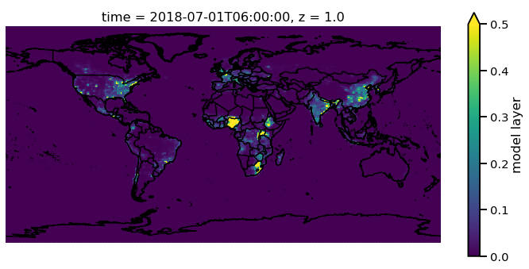
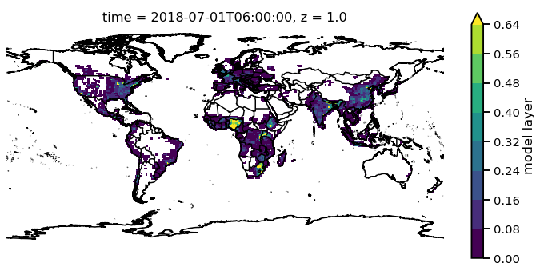
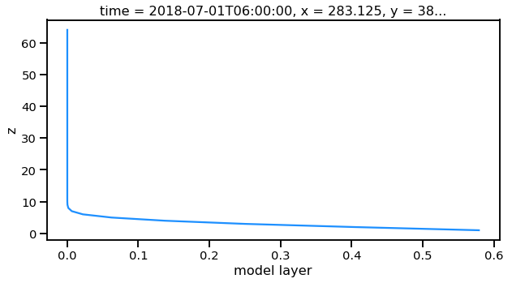
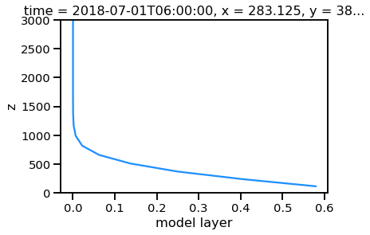

FV3-CHEM in MONET
=================

FV3-CHEM is the experimental implementation of the NASA Gocart model
into NOAA's Next Generation Global Prediction System. This tutorial will
explain how to open read and use MONET to explore output from the
FV3-CHEM system.

Currently, FV3 outputs data in three formats, i.e., nemsio, grib2, and
netcdf. There are slight issues with both the nemsio and grib2 data that
will be explained below but needless to say they need to be converted
with precossors.

Convert nemsio2nc4
------------------

The first format that needs to be converted is the nemsio data. This is
a binary format used within EMC that is planned to be phased out in
favor for netCDF. As a work around a converter was created to convert
the binary nemsio data into netCDF, nemsio2nc4.py.

This is a command-line script that converts the nemsio data output by
the FV3 system to netcdf4 files using a combination of mkgfsnemsioctl
found within the fv3 workflow and the climate data operators (cdo). This
tool is available on github at https://github.com/bbakernoaa/nemsio2nc4

::

    nemsio2nc4.py --help
    usage: nemsio2nc4.py [-h] -f FILES [-n NPROCS] [-v]

    convert nemsio file to netCDF4 file

    optional arguments:
      -h, --help            show this help message and exit
      -f FILES, --files FILES
                            input nemsio file name (default: None)
      -v, --verbose         print debugging information (default: False)

Example Usage
~~~~~~~~~~~~~

If you want to convert a single nemsio data file to netcdf4, it can be
done like this:

::

    nemsio2nc4.py -v -f 'gfs.t00z.atmf000.nemsio'
    mkgfsnemsioctl: /gpfs/hps3/emc/naqfc/noscrub/Barry.Baker/FV3CHEM/exec/mkgfsnemsioctl
    cdo: /naqfc/noscrub/Barry.Baker/python/envs/monet/bin/cdo
    Executing: /gpfs/hps3/emc/naqfc/noscrub/Barry.Baker/FV3CHEM/exec/mkgfsnemsioctl gfs.t00z.atmf000.nemsio
    Executing: /naqfc/noscrub/Barry.Baker/python/envs/monet/bin/cdo -f nc4 import_binary gfs.t00z.atmf000.nemsio.ctl gfs.t00z.atmf000.nemsio.nc4
    cdo import_binary: Processed 35 variables [1.56s 152MB]

To convert multiple files you can simple use the hot keys available in
linux terminals.

::

     nemsio2nc4.py -v -f 'gfs.t00z.atmf0*.nemsio'

Convert fv3grib2nc4
-------------------

Although there are several ways in which to read grib data from python
such as pynio, a converter was created due to the specific need to
distinguish aerosols which these readers do not process well.

fv3grib2nc4.py like nemsio2nc4.py tool is a command line tool created to
convert the grib2 aerosol data to netcdf files. fv3grib2nc4.py will
create seperate files for each of the three layer types; '1 hybrid
layer', 'entire atmosphere', and 'surface'. These are the three layers
that currently hold aerosol data. The tool is available at
https://github.com/bbakernoaa/fv3grib2nc4

::

    fv3grib2nc4.py --help
    usage: fv3grib2nc4.py [-h] -f FILES [-v]

    convert nemsio file to netCDF4 file

    optional arguments:
      -h, --help            show this help message and exit
      -f FILES, --files FILES
                            input nemsio file name (default: None)
      -v, --verbose         print debugging information (default: False) ```

    ### Example Usage

    If you want to convert a single grib2 data file to netcdf4, it can be done like this:

fv3grib2nc4.py -v -f 'gfs.t00z.master.grb2f000' wgrib2:
/nwprod2/grib\_util.v1.0.0/exec/wgrib2 Executing:
/nwprod2/grib\_util.v1.0.0/exec/wgrib2 gfs.t00z.master.grb2f000 -match
"entire atmosphere:" -nc\_nlev 1 -append -set\_ext\_name 1 -netcdf
gfs.t00z.master.grb2f000.entire\_atm.nc Executing:
/nwprod2/grib\_util.v1.0.0/exec/wgrib2 gfs.t00z.master.grb2f000 -match
"1 hybrid level:" -append -set\_ext\_name 1 -netcdf
gfs.t00z.master.grb2f000.hybrid.nc Executing:
/nwprod2/grib\_util.v1.0.0/exec/wgrib2 gfs.t00z.master.grb2f000 -match
"surface:" -nc\_nlev 1 -append -set\_ext\_name 1 -netcdf
gfs.t00z.master.grb2f000.surface.nc\`\`\`

To convert multiple files you can simple use the hot keys available in
linux terminals.

::

     fv3grib2nc4.py -v -f 'gfs.t00z.master.grb2f0*'

Using MONET
-----------

Using MONET with FV3-Chem is much like using MONET with other model
outputs. It tries to recognize where the files came from (nemsio, grib2,
etc....) and then processes the data, renaming coordinates (lat lon to
latitude and longitude) and processing varaibles like geopotential
height and pressure if available. First lets import ``monet`` and
``fv3chem`` from MONET

.. code-block:: python

    import matplotlib.pyplot as plt
    from monet.models import fv3chem

To open a single file

.. code-block:: python

    f = fv3chem.open_dataset('/Users/barry/Desktop/temp/gfs.t00z.atmf006.nemsio.nc4')
    print(f)


.. parsed-literal::

    /Users/barry/Desktop/temp/gfs.t00z.atmf006.nemsio.nc4
    <xarray.Dataset>
    Dimensions:    (time: 1, x: 384, y: 192, z: 64)
    Coordinates:
      * time       (time) datetime64[ns] 2018-07-01T06:00:00
      * x          (x) float64 0.0 0.9375 1.875 2.812 ... 356.2 357.2 358.1 359.1
      * y          (y) float64 89.28 88.36 87.42 86.49 ... -87.42 -88.36 -89.28
      * z          (z) float64 1.0 2.0 3.0 4.0 5.0 6.0 ... 60.0 61.0 62.0 63.0 64.0
        longitude  (y, x) float64 0.0 0.9375 1.875 2.812 ... 356.2 357.2 358.1 359.1
        latitude   (y, x) float64 89.28 89.28 89.28 89.28 ... -89.28 -89.28 -89.28
    Data variables:
        ugrd       (time, z, y, x) float32 dask.array<shape=(1, 64, 192, 384), chunksize=(1, 64, 192, 384)>
        vgrd       (time, z, y, x) float32 dask.array<shape=(1, 64, 192, 384), chunksize=(1, 64, 192, 384)>
        dzdt       (time, z, y, x) float32 dask.array<shape=(1, 64, 192, 384), chunksize=(1, 64, 192, 384)>
        delz       (time, z, y, x) float32 dask.array<shape=(1, 64, 192, 384), chunksize=(1, 64, 192, 384)>
        tmp        (time, z, y, x) float32 dask.array<shape=(1, 64, 192, 384), chunksize=(1, 64, 192, 384)>
        dpres      (time, z, y, x) float32 dask.array<shape=(1, 64, 192, 384), chunksize=(1, 64, 192, 384)>
        spfh       (time, z, y, x) float32 dask.array<shape=(1, 64, 192, 384), chunksize=(1, 64, 192, 384)>
        clwmr      (time, z, y, x) float32 dask.array<shape=(1, 64, 192, 384), chunksize=(1, 64, 192, 384)>
        rwmr       (time, z, y, x) float32 dask.array<shape=(1, 64, 192, 384), chunksize=(1, 64, 192, 384)>
        icmr       (time, z, y, x) float32 dask.array<shape=(1, 64, 192, 384), chunksize=(1, 64, 192, 384)>
        snmr       (time, z, y, x) float32 dask.array<shape=(1, 64, 192, 384), chunksize=(1, 64, 192, 384)>
        grle       (time, z, y, x) float32 dask.array<shape=(1, 64, 192, 384), chunksize=(1, 64, 192, 384)>
        cld_amt    (time, z, y, x) float32 dask.array<shape=(1, 64, 192, 384), chunksize=(1, 64, 192, 384)>
        o3mr       (time, z, y, x) float32 dask.array<shape=(1, 64, 192, 384), chunksize=(1, 64, 192, 384)>
        so2        (time, z, y, x) float32 dask.array<shape=(1, 64, 192, 384), chunksize=(1, 64, 192, 384)>
        sulf       (time, z, y, x) float32 dask.array<shape=(1, 64, 192, 384), chunksize=(1, 64, 192, 384)>
        dms        (time, z, y, x) float32 dask.array<shape=(1, 64, 192, 384), chunksize=(1, 64, 192, 384)>
        msa        (time, z, y, x) float32 dask.array<shape=(1, 64, 192, 384), chunksize=(1, 64, 192, 384)>
        pm25       (time, z, y, x) float32 dask.array<shape=(1, 64, 192, 384), chunksize=(1, 64, 192, 384)>
        bc1        (time, z, y, x) float32 dask.array<shape=(1, 64, 192, 384), chunksize=(1, 64, 192, 384)>
        bc2        (time, z, y, x) float32 dask.array<shape=(1, 64, 192, 384), chunksize=(1, 64, 192, 384)>
        oc1        (time, z, y, x) float32 dask.array<shape=(1, 64, 192, 384), chunksize=(1, 64, 192, 384)>
        oc2        (time, z, y, x) float32 dask.array<shape=(1, 64, 192, 384), chunksize=(1, 64, 192, 384)>
        dust1      (time, z, y, x) float32 dask.array<shape=(1, 64, 192, 384), chunksize=(1, 64, 192, 384)>
        dust2      (time, z, y, x) float32 dask.array<shape=(1, 64, 192, 384), chunksize=(1, 64, 192, 384)>
        dust3      (time, z, y, x) float32 dask.array<shape=(1, 64, 192, 384), chunksize=(1, 64, 192, 384)>
        dust4      (time, z, y, x) float32 dask.array<shape=(1, 64, 192, 384), chunksize=(1, 64, 192, 384)>
        dust5      (time, z, y, x) float32 dask.array<shape=(1, 64, 192, 384), chunksize=(1, 64, 192, 384)>
        seas1      (time, z, y, x) float32 dask.array<shape=(1, 64, 192, 384), chunksize=(1, 64, 192, 384)>
        seas2      (time, z, y, x) float32 dask.array<shape=(1, 64, 192, 384), chunksize=(1, 64, 192, 384)>
        seas3      (time, z, y, x) float32 dask.array<shape=(1, 64, 192, 384), chunksize=(1, 64, 192, 384)>
        seas4      (time, z, y, x) float32 dask.array<shape=(1, 64, 192, 384), chunksize=(1, 64, 192, 384)>
        pm10       (time, z, y, x) float32 dask.array<shape=(1, 64, 192, 384), chunksize=(1, 64, 192, 384)>
        pressfc    (time, y, x) float32 dask.array<shape=(1, 192, 384), chunksize=(1, 192, 384)>
        hgtsfc     (time, y, x) float32 dask.array<shape=(1, 192, 384), chunksize=(1, 192, 384)>
        geohgt     (time, z, y, x) float32 dask.array<shape=(1, 64, 192, 384), chunksize=(1, 64, 192, 384)>
    Attributes:
        CDI:          Climate Data Interface version 1.9.5 (http://mpimet.mpg.de/...
        Conventions:  CF-1.6
        history:      Thu Dec 20 17:46:09 2018: cdo -f nc4 import_binary gfs.t00z...
        CDO:          Climate Data Operators version 1.9.5 (http://mpimet.mpg.de/...


Notice this object f has dimensions of (time,z,y,x) with 2d coordinates
of latitude and longitude. You can get more infomation on single
varaibles such as pm25 simply by printing the varaible.

.. code-block:: python

    print(f.pm25)


.. parsed-literal::

    <xarray.DataArray 'pm25' (time: 1, z: 64, y: 192, x: 384)>
    dask.array<shape=(1, 64, 192, 384), dtype=float32, chunksize=(1, 64, 192, 384)>
    Coordinates:
      * time       (time) datetime64[ns] 2018-07-01T06:00:00
      * x          (x) float64 0.0 0.9375 1.875 2.812 ... 356.2 357.2 358.1 359.1
      * y          (y) float64 89.28 88.36 87.42 86.49 ... -87.42 -88.36 -89.28
      * z          (z) float64 1.0 2.0 3.0 4.0 5.0 6.0 ... 60.0 61.0 62.0 63.0 64.0
        longitude  (y, x) float64 0.0 0.9375 1.875 2.812 ... 356.2 357.2 358.1 359.1
        latitude   (y, x) float64 89.28 89.28 89.28 89.28 ... -89.28 -89.28 -89.28
    Attributes:
        long_name:  model layer


Here units are not included because it is not stored in the nemsio
format.

Quick Map Plotting
~~~~~~~~~~~~~~~~~~

Now one of the main things that will need to be done is plotting on a
map. This can be done quickly using the functionallity in MONET. In this
example we will plot the first layer PM2.5 at time 2018-07-01.

.. code-block:: python

    f.pm25[0,0,:,:].monet.quick_map()


.. parsed-literal::

    [########################################] | 100% Completed |  0.1s
    [########################################] | 100% Completed |  0.2s
    [########################################] | 100% Completed |  0.1s
    [########################################] | 100% Completed |  0.2s


.. parsed-literal::

    <cartopy.mpl.geoaxes.GeoAxesSubplot at 0x1c164f2dd8>


.. image:: output_8_2.png


Adjusting the scale is simple by suppling ``vmin`` and ``vmax``. Lets
set a minimum of 0 AOD and maximum of 0.5.

.. code-block:: python

    f.pm25[0,0,:,:].monet.quick_map(vmin=0,vmax=.5)


.. parsed-literal::

    [########################################] | 100% Completed |  0.1s
    [########################################] | 100% Completed |  0.2s
    [########################################] | 100% Completed |  0.1s
    [########################################] | 100% Completed |  0.2s


.. parsed-literal::

    <cartopy.mpl.geoaxes.GeoAxesSubplot at 0x1c18cbf6d8>





Now we have all the control that xarray has built into their plotting
routines. For example, lets have a descrete colorbar with 10 levels,
``levels=10``, and let it determine the levels by throwing out the top
and bottom 2% of values using the ``robust=True``

.. code-block:: python

    f.pm25[0,0,:,:].monet.quick_map(levels=10,robust=True)


.. parsed-literal::

    [########################################] | 100% Completed |  0.1s
    [########################################] | 100% Completed |  0.2s
    [########################################] | 100% Completed |  0.1s
    [########################################] | 100% Completed |  0.2s


.. parsed-literal::

    <cartopy.mpl.geoaxes.GeoAxesSubplot at 0x1c1905ce48>


.. image:: output_12_2.png


Now there are a lot of very low values, since this is at the beginning
of the simulation so lets mask out values less than 0.015 AOD.

.. code-block:: python

    f.pm25.where(f.pm25 > 0.015)[0,0,:,:].monet.quick_map(levels=10,robust=True)


.. parsed-literal::

    [########################################] | 100% Completed |  0.1s
    [########################################] | 100% Completed |  0.2s
    [########################################] | 100% Completed |  0.1s
    [########################################] | 100% Completed |  0.2s


.. parsed-literal::

    <cartopy.mpl.geoaxes.GeoAxesSubplot at 0x1c19635240>





For more information on plotting with xarray and matplotlib some useful
links are shown below

-  `Xarray
   Plotting <http://xarray.pydata.org/en/stable/plotting.html#two-dimensions>`__
-  `Matplotlib
   Colorbars <https://matplotlib.org/tutorials/colors/colormaps.html>`__

Nearest neighbor
~~~~~~~~~~~~~~~~

Monet has some extra functionality that may be useful for exploritory
studies such as nearest neighbor finder. Lets find the nearest neighbor
to NCWCP (38.972 N, 76.9245 W).

.. code-block:: python

    nn = f.pm25.monet.nearest_latlon(lat=38.972,lon=-76.9245)
    print(nn)


.. parsed-literal::

    <xarray.DataArray 'pm25' (time: 1, z: 64)>
    dask.array<shape=(1, 64), dtype=float32, chunksize=(1, 64)>
    Coordinates:
      * time       (time) datetime64[ns] 2018-07-01T06:00:00
        x          float64 283.1
        y          float64 38.81
      * z          (z) float64 1.0 2.0 3.0 4.0 5.0 6.0 ... 60.0 61.0 62.0 63.0 64.0
        longitude  float64 283.1
        latitude   float64 38.81
    Attributes:
        long_name:  model layer


Now we can do a quick plot of this vertically, since it was a single
time step.

.. code-block:: python

    nn.plot(aspect=2,size=5)


.. parsed-literal::

    [########################################] | 100% Completed |  0.1s
    [########################################] | 100% Completed |  0.1s


.. parsed-literal::

    [<matplotlib.lines.Line2D at 0x1c194702e8>]


.. image:: output_19_2.png


Now this is a simple plot but it is usually valuable to view the
vertical coordinate on the y-axis.

.. code-block:: python

    nn.plot(y='z',aspect=2,size=5)


.. parsed-literal::

    [########################################] | 100% Completed |  0.1s
    [########################################] | 100% Completed |  0.2s
    [########################################] | 100% Completed |  0.1s
    [########################################] | 100% Completed |  0.2s


.. parsed-literal::

    [<matplotlib.lines.Line2D at 0x1c1c0bbac8>]





Now this is not very useful because the vertical coordinate right now is
just the layer number. Lets get the geopoential height at this location
and add it as a coordinate to plot.

.. code-block:: python

    geohgt = f.geohgt.monet.nearest_latlon(lat=38.972,lon=-76.9245).squeeze()
    geohgt


.. parsed-literal::

    <xarray.DataArray 'geohgt' (z: 64)>
    dask.array<shape=(64,), dtype=float32, chunksize=(64,)>
    Coordinates:
        time       datetime64[ns] 2018-07-01T06:00:00
        x          float64 283.1
        y          float64 38.81
      * z          (z) float64 1.0 2.0 3.0 4.0 5.0 6.0 ... 60.0 61.0 62.0 63.0 64.0
        longitude  float64 283.1
        latitude   float64 38.81
    Attributes:
        long_name:  Geopotential Height
        units:      m


.. code-block:: python

    nn['z'] = geohgt.values
    nn.plot(y='z')
    plt.ylim([0,3000])


.. parsed-literal::

    [########################################] | 100% Completed |  0.3s
    [########################################] | 100% Completed |  0.4s
    [########################################] | 100% Completed |  0.1s
    [########################################] | 100% Completed |  0.2s
    [########################################] | 100% Completed |  0.1s
    [########################################] | 100% Completed |  0.2s


.. parsed-literal::

    (0, 3000)





Constant Latitude and Longitude
~~~~~~~~~~~~~~~~~~~~~~~~~~~~~~~

Sometimes it may be useful to see a latitudinal or longitudinal cross
section. This feature is included in monet through the
``xr.DataArray.monet`` accessor. Lets take a constant latitude at 10
degrees N.

.. code-block:: python

    pm25_constant_lat = f.pm25.monet.interp_constant_lat(lat=10., method='bilinear')
    pm25_constant_lat


.. parsed-literal::

    Create weight file: bilinear_192x384_192x1.nc
    [########################################] | 100% Completed |  0.1s
    [########################################] | 100% Completed |  0.2s


.. parsed-literal::

    <xarray.DataArray 'pm25' (time: 1, z: 64, x: 192, y: 1)>
    array([[[[8.107865e-02],
             ...,
             [4.765707e-02]],

            ...,

            [[9.984020e-05],
             ...,
             [9.982444e-05]]]])
    Coordinates:
        longitude  (x, y) float64 0.0 1.88 3.76 5.64 ... 353.4 355.3 357.2 359.1
        latitude   (x, y) float64 10.0 10.0 10.0 10.0 10.0 ... 10.0 10.0 10.0 10.0
      * time       (time) datetime64[ns] 2018-07-01T06:00:00
      * z          (z) float64 1.0 2.0 3.0 4.0 5.0 6.0 ... 60.0 61.0 62.0 63.0 64.0
    Dimensions without coordinates: x, y
    Attributes:
        regrid_method:  bilinear


Like before lets go ahead and get the geopotential height along this
latitude.

.. code-block:: python

    geoght_constant_lat = f.geohgt.monet.interp_constant_lat(lat=10., method='bilinear')
    pm25_constant_lat['geohgt'] = geoght_constant_lat


.. parsed-literal::

    Overwrite existing file: bilinear_192x384_192x1.nc
     You can set reuse_weights=True to save computing time.
    [########################################] | 100% Completed |  0.7s
    [########################################] | 100% Completed |  0.8s


Let us plot the 2D cross track (height vs longitude).

.. code-block:: python

    pm25_constant_lat.plot(x='longitude',y='geohgt',robust=True,ylim=1000,aspect=2,size=5)
    plt.ylim([0,50000])


.. parsed-literal::

    (0, 50000)


.. image:: output_30_1.png

Calculate Pressure Levels
~~~~~~~~~~~~~~~~~~~~~~~~~

By default pressure levels are not calculated due to processing time,
however, MONET does include a helper function in the fv3chem module,
``fv3chem.calc_nemsio_pressure``.

.. code-block:: python

    f = fv3chem.calc_nemsio_pressure(f)
    f


.. parsed-literal::

    [########################################] | 100% Completed |  0.1s
    [########################################] | 100% Completed |  0.2s
    [########################################] | 100% Completed |  0.1s
    [########################################] | 100% Completed |  0.2s


.. parsed-literal::

    <xarray.DataArray 'press' (time: 1, z: 64, y: 192, x: 384)>
    array([[[[1.002220e+03, ..., 1.002230e+03],
             ...,
             [6.768812e+02, ..., 6.770022e+02]],

            ...,

            [[2.037354e-01, ..., 2.038117e-01],
             ...,
             [3.515549e-01, ..., 3.512193e-01]]]], dtype=float32)
    Coordinates:
      * time       (time) datetime64[ns] 2018-07-01T06:00:00
      * x          (x) float64 0.0 0.9375 1.875 2.812 ... 356.2 357.2 358.1 359.1
      * y          (y) float64 89.28 88.36 87.42 86.49 ... -87.42 -88.36 -89.28
      * z          (z) float64 1.0 2.0 3.0 4.0 5.0 6.0 ... 60.0 61.0 62.0 63.0 64.0
        longitude  (y, x) float64 0.0 0.9375 1.875 2.812 ... 356.2 357.2 358.1 359.1
        latitude   (y, x) float64 89.28 89.28 89.28 89.28 ... -89.28 -89.28 -89.28
    Attributes:
        units:      mb
        long_name:  Mid Layer Pressure
