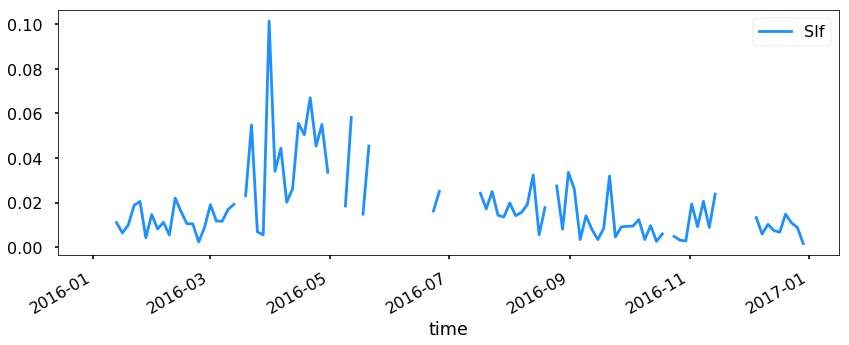
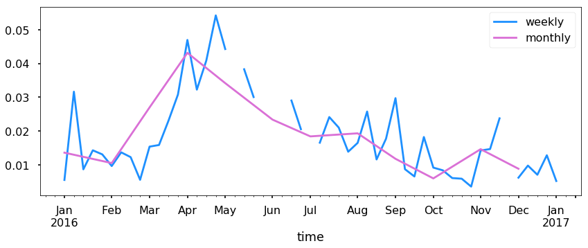
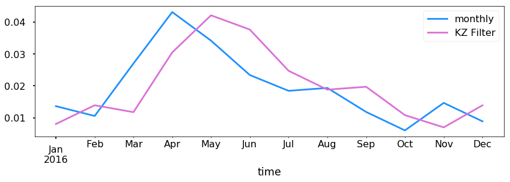
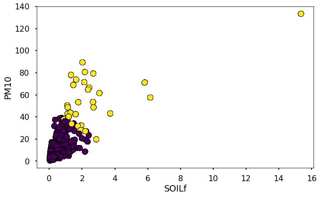

Loading IMPROVE Data
--------------------

In this tutorial we will read and load data from the IMPROVE aerosol
network (http://vista.cira.colostate.edu/Improve/)

To do this we need to first download the data from the colstate.edu
website. There are a few format requirements needed to be compatible
with MONET. First go to
http://views.cira.colostate.edu/fed/DataWizard/Default.aspx to download
data.

-  Select the Raw data
-  Datasets is the “IMPROVE aerosol”
-  Select any number of sites
-  Select your parameters
-  Select the dates in question
-  Fields

   -  Dataset (required)
   -  Site (required)
   -  POC (required)
   -  Date (required)
   -  Parameter (required)
   -  Data Value (required)
   -  Latitude (required)
   -  Longitude (required)
   -  State (optional)
   -  EPACode (optional)

-  Options

   -  skinny format
   -  delimited (note you will need to pass this onto the open command,
      ‘,’ by default)

After downloading we can then read the data. Here we included the
EPACode and State to add additional meta data stored on the EPA auxilary
files used in the EPA AQS and AirNow datasets in MONET. Let’s make a few
imports from monet and some other libraries that will aid us later.

.. code-block:: python

    from monet.obs import improve
    import matplotlib.pyplot as plt
    from monet.util import tools
    from monet.plots import *
    import pandas as pd

Now we will load the data (in this case the file is
‘2018620155016911Q1N0Mq.txt’)

.. code-block:: python

    df = improve.add_data('/Users/barry/Desktop/20186258419212M0xuxu.txt', add_meta=False, delimiter=',')
    from numpy import NaN
    df['obs'].loc[df.obs < 0] = NaN

.. parsed-literal::

    /anaconda3/lib/python3.6/site-packages/pandas/core/indexing.py:189: SettingWithCopyWarning:
    A value is trying to be set on a copy of a slice from a DataFrame

    See the caveats in the documentation: http://pandas.pydata.org/pandas-docs/stable/indexing.html#indexing-view-versus-copy
      self._setitem_with_indexer(indexer, value)

Lets look at the dataframe

.. code-block:: python

    df.head(20)

.. raw:: html

    

    
    <table border="1" class="dataframe">
      <thead>
        <tr style="text-align: right;">
          <th></th>
          <th>siteid</th>
          <th>poc</th>
          <th>time</th>
          <th>variable</th>
          <th>obs</th>
          <th>unc</th>
          <th>mdl</th>
          <th>units</th>
          <th>latitude</th>
          <th>longitude</th>
          <th>elevation</th>
          <th>state_name</th>
          <th>epaid</th>
        </tr>
      </thead>
      <tbody>
        <tr>
          <th>0</th>
          <td>ACAD1</td>
          <td>1</td>
          <td>2016-01-01</td>
          <td>ALf</td>
          <td>NaN</td>
          <td>0.00121</td>
          <td>0.00199</td>
          <td>ug/m^3 LC</td>
          <td>44.3771</td>
          <td>-68.261</td>
          <td>157.3333</td>
          <td>ME</td>
          <td>230090103</td>
        </tr>
        <tr>
          <th>1</th>
          <td>ACAD1</td>
          <td>1</td>
          <td>2016-01-01</td>
          <td>ASf</td>
          <td>NaN</td>
          <td>0.00014</td>
          <td>0.00022</td>
          <td>ug/m^3 LC</td>
          <td>44.3771</td>
          <td>-68.261</td>
          <td>157.3333</td>
          <td>ME</td>
          <td>230090103</td>
        </tr>
        <tr>
          <th>2</th>
          <td>ACAD1</td>
          <td>1</td>
          <td>2016-01-01</td>
          <td>BRf</td>
          <td>0.00050</td>
          <td>0.00011</td>
          <td>0.00016</td>
          <td>ug/m^3 LC</td>
          <td>44.3771</td>
          <td>-68.261</td>
          <td>157.3333</td>
          <td>ME</td>
          <td>230090103</td>
        </tr>
        <tr>
          <th>3</th>
          <td>ACAD1</td>
          <td>1</td>
          <td>2016-01-01</td>
          <td>CAf</td>
          <td>NaN</td>
          <td>0.00143</td>
          <td>0.00234</td>
          <td>ug/m^3 LC</td>
          <td>44.3771</td>
          <td>-68.261</td>
          <td>157.3333</td>
          <td>ME</td>
          <td>230090103</td>
        </tr>
        <tr>
          <th>4</th>
          <td>ACAD1</td>
          <td>1</td>
          <td>2016-01-01</td>
          <td>CHLf</td>
          <td>NaN</td>
          <td>0.00376</td>
          <td>0.00744</td>
          <td>ug/m^3 LC</td>
          <td>44.3771</td>
          <td>-68.261</td>
          <td>157.3333</td>
          <td>ME</td>
          <td>230090103</td>
        </tr>
        <tr>
          <th>5</th>
          <td>ACAD1</td>
          <td>1</td>
          <td>2016-01-01</td>
          <td>CLf</td>
          <td>0.00085</td>
          <td>0.00051</td>
          <td>0.00081</td>
          <td>ug/m^3 LC</td>
          <td>44.3771</td>
          <td>-68.261</td>
          <td>157.3333</td>
          <td>ME</td>
          <td>230090103</td>
        </tr>
        <tr>
          <th>6</th>
          <td>ACAD1</td>
          <td>1</td>
          <td>2016-01-01</td>
          <td>CRf</td>
          <td>0.00015</td>
          <td>0.00010</td>
          <td>0.00015</td>
          <td>ug/m^3 LC</td>
          <td>44.3771</td>
          <td>-68.261</td>
          <td>157.3333</td>
          <td>ME</td>
          <td>230090103</td>
        </tr>
        <tr>
          <th>7</th>
          <td>ACAD1</td>
          <td>1</td>
          <td>2016-01-01</td>
          <td>CUf</td>
          <td>NaN</td>
          <td>0.00014</td>
          <td>0.00022</td>
          <td>ug/m^3 LC</td>
          <td>44.3771</td>
          <td>-68.261</td>
          <td>157.3333</td>
          <td>ME</td>
          <td>230090103</td>
        </tr>
        <tr>
          <th>8</th>
          <td>ACAD1</td>
          <td>1</td>
          <td>2016-01-01</td>
          <td>ECf</td>
          <td>0.11758</td>
          <td>0.01481</td>
          <td>0.00900</td>
          <td>ug/m^3 LC</td>
          <td>44.3771</td>
          <td>-68.261</td>
          <td>157.3333</td>
          <td>ME</td>
          <td>230090103</td>
        </tr>
        <tr>
          <th>9</th>
          <td>ACAD1</td>
          <td>1</td>
          <td>2016-01-01</td>
          <td>EC1f</td>
          <td>0.15773</td>
          <td>0.01700</td>
          <td>0.01270</td>
          <td>ug/m^3 LC</td>
          <td>44.3771</td>
          <td>-68.261</td>
          <td>157.3333</td>
          <td>ME</td>
          <td>230090103</td>
        </tr>
        <tr>
          <th>10</th>
          <td>ACAD1</td>
          <td>1</td>
          <td>2016-01-01</td>
          <td>EC2f</td>
          <td>0.08037</td>
          <td>0.01439</td>
          <td>0.00900</td>
          <td>ug/m^3 LC</td>
          <td>44.3771</td>
          <td>-68.261</td>
          <td>157.3333</td>
          <td>ME</td>
          <td>230090103</td>
        </tr>
        <tr>
          <th>11</th>
          <td>ACAD1</td>
          <td>1</td>
          <td>2016-01-01</td>
          <td>EC3f</td>
          <td>NaN</td>
          <td>0.00450</td>
          <td>0.00900</td>
          <td>ug/m^3 LC</td>
          <td>44.3771</td>
          <td>-68.261</td>
          <td>157.3333</td>
          <td>ME</td>
          <td>230090103</td>
        </tr>
        <tr>
          <th>12</th>
          <td>ACAD1</td>
          <td>1</td>
          <td>2016-01-01</td>
          <td>FEf</td>
          <td>0.00397</td>
          <td>0.00088</td>
          <td>0.00139</td>
          <td>ug/m^3 LC</td>
          <td>44.3771</td>
          <td>-68.261</td>
          <td>157.3333</td>
          <td>ME</td>
          <td>230090103</td>
        </tr>
        <tr>
          <th>13</th>
          <td>ACAD1</td>
          <td>1</td>
          <td>2016-01-01</td>
          <td>Kf</td>
          <td>0.01480</td>
          <td>0.00069</td>
          <td>0.00087</td>
          <td>ug/m^3 LC</td>
          <td>44.3771</td>
          <td>-68.261</td>
          <td>157.3333</td>
          <td>ME</td>
          <td>230090103</td>
        </tr>
        <tr>
          <th>14</th>
          <td>ACAD1</td>
          <td>1</td>
          <td>2016-01-01</td>
          <td>MF</td>
          <td>1.38909</td>
          <td>0.16326</td>
          <td>0.31570</td>
          <td>ug/m^3 LC</td>
          <td>44.3771</td>
          <td>-68.261</td>
          <td>157.3333</td>
          <td>ME</td>
          <td>230090103</td>
        </tr>
        <tr>
          <th>15</th>
          <td>ACAD1</td>
          <td>1</td>
          <td>2016-01-01</td>
          <td>MGf</td>
          <td>NaN</td>
          <td>0.00207</td>
          <td>0.00340</td>
          <td>ug/m^3 LC</td>
          <td>44.3771</td>
          <td>-68.261</td>
          <td>157.3333</td>
          <td>ME</td>
          <td>230090103</td>
        </tr>
        <tr>
          <th>16</th>
          <td>ACAD1</td>
          <td>1</td>
          <td>2016-01-01</td>
          <td>MNf</td>
          <td>NaN</td>
          <td>0.00020</td>
          <td>0.00033</td>
          <td>ug/m^3 LC</td>
          <td>44.3771</td>
          <td>-68.261</td>
          <td>157.3333</td>
          <td>ME</td>
          <td>230090103</td>
        </tr>
        <tr>
          <th>17</th>
          <td>ACAD1</td>
          <td>1</td>
          <td>2016-01-01</td>
          <td>MT</td>
          <td>2.80114</td>
          <td>0.22824</td>
          <td>0.42441</td>
          <td>ug/m^3 LC</td>
          <td>44.3771</td>
          <td>-68.261</td>
          <td>157.3333</td>
          <td>ME</td>
          <td>230090103</td>
        </tr>
        <tr>
          <th>18</th>
          <td>ACAD1</td>
          <td>1</td>
          <td>2016-01-01</td>
          <td>N2f</td>
          <td>NaN</td>
          <td>0.02791</td>
          <td>0.05438</td>
          <td>ug/m^3 LC</td>
          <td>44.3771</td>
          <td>-68.261</td>
          <td>157.3333</td>
          <td>ME</td>
          <td>230090103</td>
        </tr>
        <tr>
          <th>19</th>
          <td>ACAD1</td>
          <td>1</td>
          <td>2016-01-01</td>
          <td>NAf</td>
          <td>NaN</td>
          <td>0.00257</td>
          <td>0.00412</td>
          <td>ug/m^3 LC</td>
          <td>44.3771</td>
          <td>-68.261</td>
          <td>157.3333</td>
          <td>ME</td>
          <td>230090103</td>
        </tr>
      </tbody>
    </table>
    

Now this is in the long pandas format. Lets use the
monet.util.tools.long_to_wide utility to reformat the dataframe into a
wide format.

.. code-block:: python

    from monet.util import tools
    df1 = tools.long_to_wide(df)
    df1.head()

.. raw:: html

    

    
    <table border="1" class="dataframe">
      <thead>
        <tr style="text-align: right;">
          <th></th>
          <th>time</th>
          <th>siteid</th>
          <th>ALf</th>
          <th>ASf</th>
          <th>BRf</th>
          <th>CAf</th>
          <th>CHLf</th>
          <th>CLf</th>
          <th>CM_calculated</th>
          <th>CRf</th>
          <th>...</th>
          <th>variable</th>
          <th>obs</th>
          <th>unc</th>
          <th>mdl</th>
          <th>units</th>
          <th>latitude</th>
          <th>longitude</th>
          <th>elevation</th>
          <th>state_name</th>
          <th>epaid</th>
        </tr>
      </thead>
      <tbody>
        <tr>
          <th>0</th>
          <td>2016-01-01</td>
          <td>ACAD1</td>
          <td>NaN</td>
          <td>NaN</td>
          <td>0.0005</td>
          <td>NaN</td>
          <td>NaN</td>
          <td>0.00085</td>
          <td>1.41205</td>
          <td>0.00015</td>
          <td>...</td>
          <td>ALf</td>
          <td>NaN</td>
          <td>0.00121</td>
          <td>0.00199</td>
          <td>ug/m^3 LC</td>
          <td>44.3771</td>
          <td>-68.261</td>
          <td>157.3333</td>
          <td>ME</td>
          <td>230090103</td>
        </tr>
        <tr>
          <th>1</th>
          <td>2016-01-01</td>
          <td>ACAD1</td>
          <td>NaN</td>
          <td>NaN</td>
          <td>0.0005</td>
          <td>NaN</td>
          <td>NaN</td>
          <td>0.00085</td>
          <td>1.41205</td>
          <td>0.00015</td>
          <td>...</td>
          <td>ASf</td>
          <td>NaN</td>
          <td>0.00014</td>
          <td>0.00022</td>
          <td>ug/m^3 LC</td>
          <td>44.3771</td>
          <td>-68.261</td>
          <td>157.3333</td>
          <td>ME</td>
          <td>230090103</td>
        </tr>
        <tr>
          <th>2</th>
          <td>2016-01-01</td>
          <td>ACAD1</td>
          <td>NaN</td>
          <td>NaN</td>
          <td>0.0005</td>
          <td>NaN</td>
          <td>NaN</td>
          <td>0.00085</td>
          <td>1.41205</td>
          <td>0.00015</td>
          <td>...</td>
          <td>BRf</td>
          <td>0.0005</td>
          <td>0.00011</td>
          <td>0.00016</td>
          <td>ug/m^3 LC</td>
          <td>44.3771</td>
          <td>-68.261</td>
          <td>157.3333</td>
          <td>ME</td>
          <td>230090103</td>
        </tr>
        <tr>
          <th>3</th>
          <td>2016-01-01</td>
          <td>ACAD1</td>
          <td>NaN</td>
          <td>NaN</td>
          <td>0.0005</td>
          <td>NaN</td>
          <td>NaN</td>
          <td>0.00085</td>
          <td>1.41205</td>
          <td>0.00015</td>
          <td>...</td>
          <td>CAf</td>
          <td>NaN</td>
          <td>0.00143</td>
          <td>0.00234</td>
          <td>ug/m^3 LC</td>
          <td>44.3771</td>
          <td>-68.261</td>
          <td>157.3333</td>
          <td>ME</td>
          <td>230090103</td>
        </tr>
        <tr>
          <th>4</th>
          <td>2016-01-01</td>
          <td>ACAD1</td>
          <td>NaN</td>
          <td>NaN</td>
          <td>0.0005</td>
          <td>NaN</td>
          <td>NaN</td>
          <td>0.00085</td>
          <td>1.41205</td>
          <td>0.00015</td>
          <td>...</td>
          <td>CHLf</td>
          <td>NaN</td>
          <td>0.00376</td>
          <td>0.00744</td>
          <td>ug/m^3 LC</td>
          <td>44.3771</td>
          <td>-68.261</td>
          <td>157.3333</td>
          <td>ME</td>
          <td>230090103</td>
        </tr>
      </tbody>
    </table>
    
5 rows × 65 columns

    

Lets now plot some of the different measurements with time from a site.
In this case we will look at the PHOE1 site in Phoenix, Arizona.

.. code-block:: python

    acad1 = df1.loc[df1.siteid == 'ACAD1']
    acad1.head()

.. raw:: html

    

    
    <table border="1" class="dataframe">
      <thead>
        <tr style="text-align: right;">
          <th></th>
          <th>time</th>
          <th>siteid</th>
          <th>ALf</th>
          <th>ASf</th>
          <th>BRf</th>
          <th>CAf</th>
          <th>CHLf</th>
          <th>CLf</th>
          <th>CM_calculated</th>
          <th>CRf</th>
          <th>...</th>
          <th>variable</th>
          <th>obs</th>
          <th>unc</th>
          <th>mdl</th>
          <th>units</th>
          <th>latitude</th>
          <th>longitude</th>
          <th>elevation</th>
          <th>state_name</th>
          <th>epaid</th>
        </tr>
      </thead>
      <tbody>
        <tr>
          <th>0</th>
          <td>2016-01-01</td>
          <td>ACAD1</td>
          <td>NaN</td>
          <td>NaN</td>
          <td>0.0005</td>
          <td>NaN</td>
          <td>NaN</td>
          <td>0.00085</td>
          <td>1.41205</td>
          <td>0.00015</td>
          <td>...</td>
          <td>ALf</td>
          <td>NaN</td>
          <td>0.00121</td>
          <td>0.00199</td>
          <td>ug/m^3 LC</td>
          <td>44.3771</td>
          <td>-68.261</td>
          <td>157.3333</td>
          <td>ME</td>
          <td>230090103</td>
        </tr>
        <tr>
          <th>1</th>
          <td>2016-01-01</td>
          <td>ACAD1</td>
          <td>NaN</td>
          <td>NaN</td>
          <td>0.0005</td>
          <td>NaN</td>
          <td>NaN</td>
          <td>0.00085</td>
          <td>1.41205</td>
          <td>0.00015</td>
          <td>...</td>
          <td>ASf</td>
          <td>NaN</td>
          <td>0.00014</td>
          <td>0.00022</td>
          <td>ug/m^3 LC</td>
          <td>44.3771</td>
          <td>-68.261</td>
          <td>157.3333</td>
          <td>ME</td>
          <td>230090103</td>
        </tr>
        <tr>
          <th>2</th>
          <td>2016-01-01</td>
          <td>ACAD1</td>
          <td>NaN</td>
          <td>NaN</td>
          <td>0.0005</td>
          <td>NaN</td>
          <td>NaN</td>
          <td>0.00085</td>
          <td>1.41205</td>
          <td>0.00015</td>
          <td>...</td>
          <td>BRf</td>
          <td>0.0005</td>
          <td>0.00011</td>
          <td>0.00016</td>
          <td>ug/m^3 LC</td>
          <td>44.3771</td>
          <td>-68.261</td>
          <td>157.3333</td>
          <td>ME</td>
          <td>230090103</td>
        </tr>
        <tr>
          <th>3</th>
          <td>2016-01-01</td>
          <td>ACAD1</td>
          <td>NaN</td>
          <td>NaN</td>
          <td>0.0005</td>
          <td>NaN</td>
          <td>NaN</td>
          <td>0.00085</td>
          <td>1.41205</td>
          <td>0.00015</td>
          <td>...</td>
          <td>CAf</td>
          <td>NaN</td>
          <td>0.00143</td>
          <td>0.00234</td>
          <td>ug/m^3 LC</td>
          <td>44.3771</td>
          <td>-68.261</td>
          <td>157.3333</td>
          <td>ME</td>
          <td>230090103</td>
        </tr>
        <tr>
          <th>4</th>
          <td>2016-01-01</td>
          <td>ACAD1</td>
          <td>NaN</td>
          <td>NaN</td>
          <td>0.0005</td>
          <td>NaN</td>
          <td>NaN</td>
          <td>0.00085</td>
          <td>1.41205</td>
          <td>0.00015</td>
          <td>...</td>
          <td>CHLf</td>
          <td>NaN</td>
          <td>0.00376</td>
          <td>0.00744</td>
          <td>ug/m^3 LC</td>
          <td>44.3771</td>
          <td>-68.261</td>
          <td>157.3333</td>
          <td>ME</td>
          <td>230090103</td>
        </tr>
      </tbody>
    </table>
    
5 rows × 65 columns

    

Trend Analysis
~~~~~~~~~~~~~~

Let’s look at SIf as an example from ACAD1.

.. code-block:: python

    acad1.index = acad1.time

    acad1.plot(y='SIf', figsize=(14,5))

.. parsed-literal::

    <matplotlib.axes._subplots.AxesSubplot at 0x1c286eb4a8>

Now this is good but lets resample to see if we can see a trend.

.. code-block:: python

    ax = acad1.resample('W').mean().plot(y='SIf', figsize=(14,5), label = 'weekly')
    ax = acad1.resample('M').mean().plot(y='SIf', ax=ax, label='monthly')

Simply resampling is fine but lets try to get a signal out using a
kolmogorov-zerbenko filter. See
https://www.tandfonline.com/doi/pdf/10.1080/10473289.2005.10464718 for
more information

.. code-block:: python

    q = acad1.SIf.copy()
    for i in range(1000):
        q = q.rolling(10, min_periods=1, win_type='triang',center=True).mean()
    ax = acad1.resample('M').mean().plot(y='SIf', figsize=(14,4), label='monthly')
    q.resample('M').mean().plot(ax=ax,label='KZ Filter')
    plt.legend()

.. parsed-literal::

    <matplotlib.legend.Legend at 0x1c290de080>

KMEANS Clustering using scikit-learn
~~~~~~~~~~~~~~~~~~~~~~~~~~~~~~~~~~~~

Clustering algorithms can be very useful in finding signals within data.
As an example we are going to use the KMeans algorithm from scikit-learn
(http://scikit-learn.org/stable/modules/clustering.html#k-means) to
analyse dust signals using the improve data. First we need to import
some tools from sklearn to use in our analysis.

.. code-block:: python

    from sklearn.preprocessing import RobustScaler #to scale our data
    from sklearn.cluster import KMeans # clustering algorithm

First we want to separate out different variables that may be useful
such as Si, PM2.5, PM10, Fe, and SOILf. We will also need to drop any
NaN values so let us go ahead and do that.

.. code-block:: python

    dfkm = df1[['SIf','MF','MT','FEf','SOILf']].dropna()
    dfkm.head()

.. raw:: html

    

    
    <table border="1" class="dataframe">
      <thead>
        <tr style="text-align: right;">
          <th></th>
          <th>SIf</th>
          <th>MF</th>
          <th>MT</th>
          <th>FEf</th>
          <th>SOILf</th>
        </tr>
      </thead>
      <tbody>
        <tr>
          <th>0</th>
          <td>0.00553</td>
          <td>1.38909</td>
          <td>2.80114</td>
          <td>0.00397</td>
          <td>0.028611</td>
        </tr>
        <tr>
          <th>1</th>
          <td>0.00553</td>
          <td>1.38909</td>
          <td>2.80114</td>
          <td>0.00397</td>
          <td>0.028611</td>
        </tr>
        <tr>
          <th>2</th>
          <td>0.00553</td>
          <td>1.38909</td>
          <td>2.80114</td>
          <td>0.00397</td>
          <td>0.028611</td>
        </tr>
        <tr>
          <th>3</th>
          <td>0.00553</td>
          <td>1.38909</td>
          <td>2.80114</td>
          <td>0.00397</td>
          <td>0.028611</td>
        </tr>
        <tr>
          <th>4</th>
          <td>0.00553</td>
          <td>1.38909</td>
          <td>2.80114</td>
          <td>0.00397</td>
          <td>0.028611</td>
        </tr>
      </tbody>
    </table>
    

Usually, with sklearn it is better to scale the data first before
putting it through the algorithm. We will use th RobustScaler to do
this.

.. code-block:: python

    X_scaled = RobustScaler().fit(dfkm).transform(dfkm)

Now we will define our clustering algorithm to have 2 clusters. You may
need to adjust this as this is just a starting point for further
analysis.

.. code-block:: python

    km = KMeans(n_clusters=2).fit(X_scaled)

The clusters can be found under km.labels\_ . These are integers
representing the different clusters.

.. code-block:: python

    clusters = km.labels_

Lets plot this so that we can see where there is dust.

.. code-block:: python

    plt.figure(figsize=(10,6))
    plt.scatter(dfkm.SOILf,dfkm.MT,c=clusters,edgecolor='k')
    plt.xlabel('SOILf')
    plt.ylabel('PM10')

.. parsed-literal::

    Text(0,0.5,'PM10')

